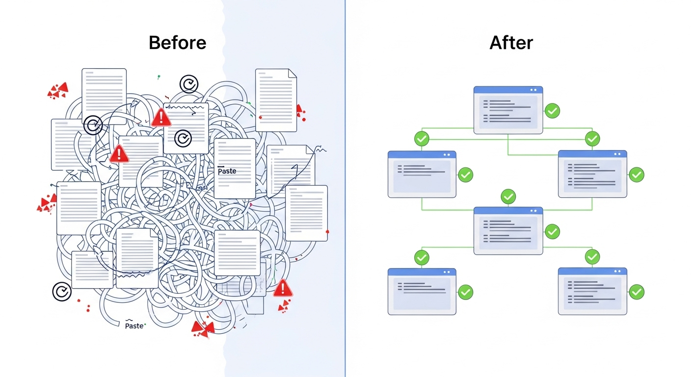
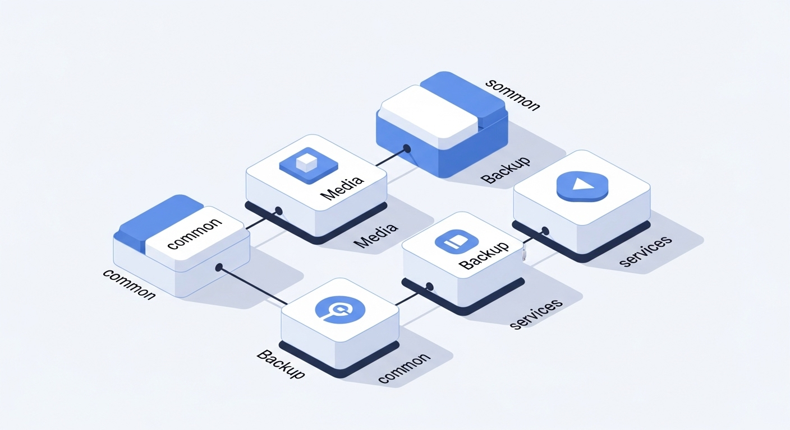

# The Constellation Pattern: Composable Infrastructure with NixOS


Managing multiple NixOS machines quickly becomes unwieldy when you copy-paste configurations between hosts. You end up with duplicated code, inconsistent settings, and the nightmare of keeping everything in sync. After running a fleet of 10+ NixOS machines ranging from ARM routers to x86 servers, I developed what I call the "Constellation Pattern" - a modular system that eliminates configuration duplication while maintaining the flexibility to customize each host.

> **Note**: All code examples in this post are from my real production NixOS configuration, available at [github.com/arsfeld/nixos](https://github.com/arsfeld/nixos).

## The Problem with Traditional NixOS Multi-Host Management



Most NixOS configurations start simple. You have one machine, one `configuration.nix`, and life is good. But as you add more hosts, you face several challenges:

**Configuration Drift**: Each host accumulates unique tweaks, making it impossible to apply consistent updates across your fleet.

**Copy-Paste Hell**: You copy working configurations between machines, creating maintenance nightmares when you need to update common settings.

**All-or-Nothing Modules**: Standard NixOS modules are often too rigid - you can't easily enable just the parts you need on different hosts.

**Dependency Management**: Services on one host might depend on services running on another host, but there's no clean way to express these relationships.

Here's what a typical problematic setup looks like:

```nix
# hosts/server1/configuration.nix
{ pkgs, ... }: {
  # 200 lines of common configuration
  services.tailscale.enable = true;
  services.openssh.enable = true;
  # ... lots of repeated configuration
  
  # Server-specific stuff mixed in
  services.postgresql.enable = true;
}

# hosts/server2/configuration.nix  
{ pkgs, ... }: {
  # Same 200 lines copied and pasted
  services.tailscale.enable = true;
  services.openssh.enable = true;
  # ... same repeated configuration
  
  # Different server-specific stuff
  services.nginx.enable = true;
}
```

## Enter the Constellation Pattern



The Constellation Pattern solves this by creating **opt-in feature modules** that can be selectively enabled on any host. Instead of copying configuration, you compose your hosts from a set of reusable, well-tested modules.

The pattern consists of:

1. **Base Module (`constellation.common`)**: Common configuration that nearly every host needs
2. **Feature Modules**: Specialized modules for specific capabilities (media, backup, services, etc.)
3. **Host Configurations**: Minimal files that just enable the modules they need

Here's how my hosts are now configured:

```nix
# hosts/storage/configuration.nix
{
  constellation.backup.enable = true;
  constellation.services.enable = true;
  constellation.media.enable = true;
  constellation.podman.enable = true;
  
  # Host-specific configuration
  networking.hostName = "storage";
  # ... minimal host-specific settings
}

# hosts/cloud/configuration.nix  
{
  constellation.podman.enable = true;
  constellation.backup.enable = true;
  constellation.services.enable = true;
  constellation.media.enable = true;
  constellation.supabase.enable = true;
  
  # Host-specific configuration
  networking.hostName = "cloud";
  nixpkgs.hostPlatform = "aarch64-linux";
}
```

Clean, declarative, and immediately obvious what each host provides.

## Anatomy of a Constellation Module

Let's examine the `constellation.common` module to understand the pattern:

```nix
# modules/constellation/common.nix
# Source: https://github.com/arsfeld/nixos/blob/master/modules/constellation/common.nix
{
  inputs,
  config,
  pkgs,
  lib,
  ...
}:
with lib; {
  options.constellation.common = {
    enable = mkOption {
      type = types.bool;
      description = "Enable common configuration";
      default = true;  # This is key - enabled by default
    };
  };

  config = lib.mkIf config.constellation.common.enable {
    # Nix configuration that every host needs
    nix = {
      settings = {
        experimental-features = "nix-command flakes";
        auto-optimise-store = true;
        substituters = [
          "https://nix-community.cachix.org?priority=41"
          "https://fly-attic.fly.dev/system"
          # ... more caches
        ];
        trusted-public-keys = [
          "nix-community.cachix.org-1:mB9FSh9qf2dCimDSUo8Zy7bkq5CX+/rkCWyvRCYg3Fs="
          # ... corresponding keys
        ];
      };
    };

    # Essential services every host needs
    services.tailscale.enable = true;
    services.openssh.enable = true;
    services.avahi.enable = true;
    
    # Common packages
    environment.systemPackages = with pkgs; [
      git htop tmux wget
      # ... essential tools
    ];
    
    # Security and performance defaults
    networking.firewall.trustedInterfaces = ["tailscale0"];
    zramSwap.enable = true;
    nix.gc = {
      automatic = true;
      dates = "Sat *-*-* 03:15:00";
      options = "--delete-older-than 30d";
    };
  };
}
```

Key principles:

- **Single Responsibility**: Each module has a clear, focused purpose
- **Sensible Defaults**: The module works out of the box with minimal configuration
- **Override Capability**: Hosts can still override specific settings when needed
- **Dependency Declaration**: Modules can reference other constellation modules

## Advanced Pattern: Service Discovery and Gateway Integration


The most sophisticated part of my constellation system is the `constellation.services` module, which automatically creates a service mesh across all hosts:

```nix
# modules/constellation/services.nix
# Source: https://github.com/arsfeld/nixos/blob/master/modules/constellation/services.nix
let
  services = {
    cloud = {
      vault = 8000;
      yarr = 7070;
      whoogle = 5000;
    };
    storage = {
      jellyfin = 8096;
      immich = 15777;
      grafana = 3010;
      gitea = 3001;
      # ... 30+ more services
    };
  };

  # Transform service definitions into gateway configuration
  generateServices = services:
    listToAttrs (builtins.concatMap
      (host:
        builtins.map
        (name: {
          inherit name;
          value = {
            inherit name host;
            port = services.${host}.${name};
            settings = {
              bypassAuth = builtins.elem name bypassAuth;
              funnel = builtins.elem name funnels;
            };
          };
        })
        (builtins.attrNames services.${host}))
      (builtins.attrNames services));
in {
  config = lib.mkIf config.constellation.services.enable {
    media.gateway = {
      enable = true;
      services = generateServices services;
    };
  };
}
```

This creates several powerful capabilities:

1. **Automatic Service Registration**: Adding a new service is just adding one line to the services definition
2. **Cross-Host Discovery**: Services automatically know how to reach services on other hosts  
3. **Gateway Integration**: Caddy reverse proxy rules are automatically generated
4. **Authentication Rules**: Services can opt into or out of authentication automatically

## Real-World Example: The Media Constellation

My `constellation.media` module shows how to handle complex multi-service deployments:

```nix
# modules/constellation/media.nix
# Source: https://github.com/arsfeld/nixos/blob/master/modules/constellation/media.nix
{
  config = lib.mkIf cfg.enable {
    media.containers = let
      storageServices = {
        # The full *arr stack
        prowlarr = { listenPort = 9696; };
        sonarr = { 
          listenPort = 8989;
          mediaVolumes = true;  # Automatically mounts media directories
        };
        radarr = { 
          listenPort = 7878;
          mediaVolumes = true;
        };
        
        # Media servers with hardware acceleration
        plex = {
          mediaVolumes = true;
          network = "host";
          devices = ["/dev/dri:/dev/dri"];  # Intel GPU passthrough
        };
        
        # Download clients
        autobrr = {
          image = "ghcr.io/autobrr/autobrr:latest";
          listenPort = 7474;
        };
      };

      cloudServices = {
        ghost = {
          image = "ghost:5";
          environment = {
            url = "https://blog.arsfeld.dev";
            database__client = "sqlite3";
          };
          listenPort = 2368;
        };
      };
    in
      # Automatically assign host labels  
      lib.mapAttrs (addHost "storage") storageServices 
      // lib.mapAttrs (addHost "cloud") cloudServices;
  };
}
```

The genius of this approach:

- **Hardware Affinity**: GPU-dependent services automatically deploy to the `storage` host with Intel graphics
- **Resource Optimization**: Lightweight services can run on the ARM `cloud` host  
- **Automatic Networking**: All services automatically get proper networking and service discovery
- **Volume Management**: Media services automatically get the right volume mounts

## Benefits of the Constellation Pattern

After running this pattern for over a year across 10+ hosts, the benefits are substantial:

**Consistency**: Every host gets the same base configuration, eliminating configuration drift.

**Maintainability**: Updating all hosts is as simple as updating a single module and redeploying.

**Composability**: New hosts are trivial to create - just enable the modules you need.

**Testing**: You can test new configurations on a single host before rolling out to the fleet.

**Documentation**: The module structure serves as living documentation of your infrastructure capabilities.

**Flexibility**: Hosts can still override specific settings when needed, maintaining NixOS's flexibility.

## Comparison with Alternatives

**vs. NixOps**: More lightweight and doesn't require a separate deployment tool. Works with any deployment method (deploy-rs, nixos-rebuild, etc.).

**vs. Terraform/Ansible**: Purely declarative with NixOS's atomic rollback capabilities. No imperative state management.

**vs. Kubernetes**: Simpler for homelab scale. No YAML hell, built-in secret management, and works on bare metal.

**vs. Docker Compose**: Better hardware integration, atomic updates, and cross-host service discovery built-in.

## Getting Started

To implement the Constellation Pattern in your own NixOS setup:

1. **Create a `modules/constellation/` directory** in your configuration repo
2. **Start with `common.nix`** - move shared configuration from your hosts into this module  
3. **Identify feature groups** - what logical groupings of services do you have?
4. **Create feature modules** - one module per major capability (media, backup, monitoring, etc.)
5. **Refactor your hosts** - replace duplicated configuration with module enables
6. **Add service discovery** - implement a gateway pattern for automatic service registration

The Constellation Pattern has transformed how I manage my self-hosted infrastructure. What started as a mess of copy-pasted configurations is now a clean, maintainable system that scales from a single Raspberry Pi to a full server fleet.

In the next post, we'll dive into multi-architecture fleet management and how to handle cross-compilation for ARM devices seamlessly within this pattern.