+++
title = "Reel Rewrite: How Relm4 Saved My Media Streaming Client"
date = 2025-09-16
aliases = ["/posts/reel-rewrite-architecture-journey/"]
draft = false

[taxonomies]
tags = ["rust", "gtk4", "relm4", "architecture", "refactoring", "media", "plex", "jellyfin"]

[extra]
toc = true
+++

A few months ago, I [introduced Reel](@/posts/2025/08/25/gnome-reel-native-media-streaming.md), my native GTK4 media streaming client for GNOME. I was excited about the progress and using it daily. But behind the scenes, I was fighting a losing battle against an architecture that was fundamentally broken. This is the story of how I nearly gave up, discovered Relm4, and rebuilt everything from the ground up.

## TL;DR

After months of battling cascading bugs and an unmaintainable state machine, I rewrote Reel using [Relm4](https://relm4.org/). The new architecture uses proper reactive components, message passing, and async workers. The migration is about 85% complete, and the result? Bugs that haunted me for weeks disappeared overnight, and adding features no longer breaks existing functionality. It's been a journey of three false starts, but the payoff has been worth every refactored line.

## When Everything Is Connected to Everything

The original Reel codebase had become what I call a "spaghetti state machine." Every component talked to every other component. Fix authentication? Suddenly sync breaks in mysterious ways. Update the cache? The UI starts behaving erratically. Add a new feature? Watch three unrelated things break.


*Figure 1: The old architecture - everything connected to everything*

Here's what the codebase structure looked like—notice how services were deeply entangled:

```
src/
├── services/           # The problematic service layer
│   ├── cache.rs       # God object managing everything
│   ├── auth.rs        # Directly manipulates cache
│   ├── sync.rs        # Updates UI through cache
│   └── player.rs      # Stateful, tightly coupled
├── ui/
│   ├── windows/       # GTK windows with business logic
│   ├── widgets/       # Widgets directly calling services
│   └── state.rs       # Global mutable state
└── models/            # Data structures mixed with logic
```

The problems started from day one with fundamental architectural mistakes:

### Wrong Abstractions

I initially designed around a single backend to Plex. Simple, right? Except users have multiple Plex servers on one account. And then Jellyfin support meant multiple account types. The entire foundation was wrong, and every feature built on top inherited these flaws.

### The Cache That Ate Everything

What started as a simple key-value cache for performance became the backbone of the entire data service. It had to know about every data type in the application—movies, shows, episodes, servers, users, settings. The cache became an accidental god object, orchestrating the entire application state.

Here's what the old AppState looked like—notice how everything is mutable and interconnected:

```rust
// Before: src/core/state.rs - The god object that ruled them all
pub struct AppState {
    pub auth_manager: Arc<AuthManager>,
    pub source_coordinator: Arc<SourceCoordinator>,
    pub current_user: Arc<RwLock<Option<User>>>,
    pub current_library: Arc<RwLock<Option<Library>>>,
    pub libraries: Arc<RwLock<HashMap<String, Vec<Library>>>>,
    pub library_items: Arc<RwLock<HashMap<String, Vec<MediaItem>>>>,
    pub data_service: Arc<DataService>,
    pub sync_manager: Arc<SyncManager>,
    pub playback_state: Arc<RwLock<PlaybackState>>,
    pub config: Arc<RwLock<Config>>,
    pub database: Arc<Database>,
    pub db_connection: DatabaseConnection,
    pub event_bus: Arc<EventBus>,
}

// UI components directly mutated this shared state
impl AppState {
    pub async fn set_library(&self, library: Library) {
        let mut current_library = self.current_library.write().await;
        *current_library = Some(library);
    }

    pub async fn sync_all_backends(&self) -> Result<Vec<SyncResult>> {
        // Direct coordination between services
        let all_backends = self.source_coordinator.get_all_backends().await;
        // ... sync logic mixed with state management ...
    }
}
```

Every bug fix made it worse. Every feature made it more entangled.

## The False Hope of Home-Grown Reactivity

Desperate for a solution, I introduced reactivity with an event bus and a property system. The idea was sound: components would react to state changes instead of directly manipulating each other. For a brief, glorious moment, it felt like salvation.

I went all in, converting code piece by piece to this new system. UI components would update through ViewModels. State changes would propagate through events. It was going to fix everything.

It didn't.

What I ended up with was worse—a hybrid monster with half the code using the old direct manipulation and half using my buggy home-grown property system. The reactive parts had their own bugs. The boundaries between old and new code were unclear. I'd created two problems instead of solving one.

## The Breaking Point

The moment I knew something had to change was when I broke the video player—again. This was supposed to be the stable part of the application, carefully designed and tested. But a seemingly unrelated change to the authentication flow cascaded through the system and broke video playback in a way I couldn't even understand.

I was tired. Really tired.

## Enter Relm4

That's when I discovered [Relm4](https://relm4.org/). It's a reactive GTK4 framework for Rust that provides proper component architecture, message passing, and state management. Reading through the documentation felt like finding exactly what I'd been trying to build myself, but actually working.

But I hesitated. A lot.

### Two False Starts

Twice I started converting code to Relm4. Twice I gave up. The problem wasn't Relm4—it was that I was trying to retrofit it onto a broken architecture. I was putting lipstick on a pig.

The service layer I'd built was inherently stateful and completely incompatible with Relm4's functional approach. The cache system fought against proper component isolation. Every conversion attempt hit the same walls because I was trying to preserve too much of the old code.

## Going All In

One particularly frustrating evening, after breaking the video player yet again while trying to add a minor feature, something snapped. I decided to burn it all down and rebuild from scratch using Relm4 properly.

This meant:
- Throwing away the entire service layer
- Deleting the god-object cache
- Redesigning the data flow from first principles
- Starting with the correct abstractions this time

The actual rewrite happened remarkably fast. Over the course of just a few days, I implemented the core components: the MessageBroker for sync integration, a complete UI overhaul with modern Adwaita design, an immersive player with proper window chrome management, and thread-safe player communication using channels.

## The New Architecture

The rewrite brought clarity. With Relm4, I could finally map concepts to architecture the right way.


*Figure 2: The new architecture - clean message-based communication*

Here's the new structure—notice the clean separation of concerns:

```
src/
├── backends/            # Backend implementations (Plex, Jellyfin)
│   ├── traits.rs       # Clean interface definitions
│   ├── plex/           # Plex-specific logic only
│   └── jellyfin/       # Jellyfin-specific logic only
├── platforms/
│   └── relm4/
│       └── components/ # Isolated UI components
│           ├── main_window.rs
│           ├── pages/  # Each page is a component
│           └── shared/
│               ├── broker.rs    # Central message passing
│               ├── messages.rs  # Message types
│               └── commands.rs  # Async workers
├── player/
│   ├── controller.rs   # Thread-safe controller
│   └── factory.rs      # Player abstraction
└── db/                  # Clean data layer
    ├── entities/       # Database models
    └── repository/     # Data access patterns
```

### Async Components
Each major UI element is now a proper component with its own state, update logic, and message handling. Components don't know about each other—they communicate through messages. Worker components handle heavy tasks like image loading and search operations without blocking the UI.

### Message Broker
Instead of direct component communication, there's now a central message broker. Components publish events; interested parties subscribe. Clean boundaries, clear data flow. The MessageBroker handles sync integration and eliminates race conditions that plagued the old architecture.

```rust
// After: src/platforms/relm4/components/shared/broker.rs
#[derive(Debug, Clone)]
pub enum BrokerMessage {
    Navigation(NavigationMessage),
    Data(DataMessage),
    Playback(PlaybackMessage),
    Source(SourceMessage),
}

// Components subscribe to specific messages
impl AsyncComponentParts for HomePage {
    fn init() {
        // Subscribe to broker messages
        let broker_sender = sender.clone();
        relm4::spawn(async move {
            BROKER.subscribe("HomePage".to_string(), broker_sender).await;
        });
    }

    fn update(&mut self, msg: Input) {
        match msg {
            Input::BrokerMsg(BrokerMessage::Data(DataMessage::LibraryUpdated { .. })) => {
                // React to library updates without direct coupling
                self.refresh_content();
            }
            _ => {}
        }
    }
}
```

### Thread-Safe Player Controller
The video player now uses a channel-based PlayerController with PlayerHandle and PlayerCommand patterns. This eliminates all the threading issues that made the player so fragile before. The immersive mode properly manages window chrome and cursor hiding.


*Figure 3: Thread-safe player communication flow*

```rust
// After: src/player/controller.rs - Thread-safe player communication
#[derive(Debug)]
pub enum PlayerCommand {
    LoadMedia {
        url: String,
        respond_to: oneshot::Sender<Result<()>>,
    },
    Play {
        respond_to: oneshot::Sender<Result<()>>,
    },
    Seek {
        position: Duration,
        respond_to: oneshot::Sender<Result<()>>,
    },
    // ... more commands with response channels
}

// Clean handle for UI components
pub struct PlayerHandle {
    sender: mpsc::Sender<PlayerCommand>,
}

impl PlayerHandle {
    pub async fn load_media(&self, url: String) -> Result<()> {
        let (tx, rx) = oneshot::channel();
        self.sender
            .send(PlayerCommand::LoadMedia { url, respond_to: tx })
            .await?;
        rx.await?
    }

    // No shared mutable state, just message passing
}
```

Compare this to the old player design where UI components directly manipulated player state through Arc<RwLock<>> patterns, leading to deadlocks and race conditions.

### Proper State Management
State lives where it belongs. UI state in components, server data in dedicated stores, settings in a configuration manager. The reactive property system provides observable data without the complexity of the home-grown solution.

Here's a complete Relm4 component showing the new pattern:

```rust
// After: Clean component with isolated state and message passing
pub struct MainWindow {
    db: DatabaseConnection,
    sidebar: Controller<Sidebar>,
    home_page: AsyncController<HomePage>,
    player_page: Option<AsyncController<PlayerPage>>,
    navigation_view: adw::NavigationView,
}

#[derive(Debug)]
pub enum MainWindowInput {
    Navigate(NavigationTarget),
    BrokerMsg(BrokerMessage),
    ShowPlayerPage(MediaItemId, PlaylistContext),
    UpdateWindowChrome { fullscreen: bool },
}

impl AsyncComponent for MainWindow {
    type Input = MainWindowInput;
    type Output = ();

    async fn update(&mut self, msg: Self::Input, sender: AsyncComponentSender<Self>) {
        match msg {
            MainWindowInput::Navigate(target) => {
                // Clean navigation without side effects
                self.navigate_to(target).await;
            }
            MainWindowInput::ShowPlayerPage(media_id, context) => {
                // Create isolated player component
                let player = PlayerPage::builder()
                    .launch(PlayerPageInit { media_id, context })
                    .forward(sender.input_sender(), |msg| {
                        MainWindowInput::BrokerMsg(msg.into())
                    });
                self.player_page = Some(player);
            }
            MainWindowInput::UpdateWindowChrome { fullscreen } => {
                // UI updates are explicit and traceable
                self.set_chrome_visibility(!fullscreen);
            }
            _ => {}
        }
    }
}
```

Compare this to the old GTK approach with its 150+ lines of wrapper enums and direct state manipulation. Each Relm4 component is self-contained, testable, and communicates only through messages.

## The Payoff

The difference has been night and day. Let me show you the numbers:

```mermaid
graph LR
    subgraph "Before"
        B1[15+ Critical Bugs]
        B2[3-4 Days per Feature]
        B3[~50% Time Debugging]
        B4[UI Freezes Common]
    end

    subgraph "After"
        A1[2 Known Issues]
        A2[<1 Day per Feature]
        A3[~10% Time Debugging]
        A4[Zero UI Freezes]
    end

    B1 -.->|🎉| A1
    B2 -.->|🚀| A2
    B3 -.->|✨| A3
    B4 -.->|⚡| A4

    style A1 fill:#51cf66,stroke:#37b24d
    style A2 fill:#51cf66,stroke:#37b24d
    style A3 fill:#51cf66,stroke:#37b24d
    style A4 fill:#51cf66,stroke:#37b24d
    style B1 fill:#ff6b6b,stroke:#c92a2a
    style B2 fill:#ff6b6b,stroke:#c92a2a
    style B3 fill:#ff6b6b,stroke:#c92a2a
    style B4 fill:#ff6b6b,stroke:#c92a2a
```


*Figure 4: The dramatic improvement in development metrics*

### Concrete Improvements

- **Bugs disappeared**: Issues that had plagued the project for months just vanished. Proper component isolation meant fixes stayed fixed.
- **Features don't break things**: Adding new functionality no longer feels like playing Jenga. Components are isolated; changes don't cascade.
- **Code is maintainable**: I can now look at a component and understand it without needing to trace through five other files.
- **Async actually works**: Proper async components mean no more UI freezes during sync operations.

## What's Left

The migration is about 85% complete, with core functionality working but some polish needed:

**Working:**
- Plex and Jellyfin server connections
- Media browsing and playback
- The new Adwaita UI with theme support
- Thread-safe player with immersive mode
- Reactive components and message passing

**Still In Progress:**
- Jellyfin sync completion
- Seek functionality refinement
- Keyboard shortcuts
- Some UI polish and missing features
- Library view optimizations

But here's the crucial difference: these are implementation tasks, not architectural battles. The foundation is solid. With 70+ tasks tracked in the backlog, I can methodically work through features knowing each addition won't destabilize the entire system.

## Lessons Learned

This rewrite taught me some hard lessons:

1. **Wrong abstractions compound**: Every feature built on a bad foundation makes things exponentially worse.

2. **Home-grown frameworks are rarely the answer**: Unless you're solving a genuinely unique problem, use battle-tested solutions.

3. **Sometimes you need to start over**: I wasted months trying to fix unfixable architecture. The rewrite took weeks and solved everything.

4. **Functional components work**: The Relm4 approach of isolated components with message passing isn't just theory—it actually makes complex UIs manageable.

## Looking Forward

With a solid foundation, I can finally focus on what matters: features and user experience. The roadmap from [the original post](@/posts/2025/08/25/gnome-reel-native-media-streaming.md) is still valid, but now it's actually achievable.

The next few releases will bring:
- Completed Jellyfin support
- Search and filtering
- Local file playback
- Music library support

But more importantly, I can now add these features with confidence that they won't break everything else.

## For Fellow Developers


*Figure 6: Should you rewrite? A decision framework*

If you're fighting your architecture daily, if every bug fix creates two new problems, if you dread adding features because of what might break—consider a rewrite. Not a refactor, not a gradual migration, but a ground-up rebuild with the right tools.

Yes, it's scary. Yes, you'll lose some work. But the alternative is death by a thousand cuts, slowly losing the will to work on your project as it becomes increasingly unmaintainable.

For GTK4 and Rust developers specifically: give [Relm4](https://relm4.org/) a serious look. It's not just another framework—it's a fundamentally better way to build reactive UIs.

---

*Reel is available on [GitHub](https://github.com/arsfeld/reel). The Relm4 migration is 85% complete and already more stable than the original ever was. Downloads are available as AppImage, .deb, and .rpm packages. Built with Rust, GTK4, Relm4, libadwaita, and hard-won lessons about software architecture.*
