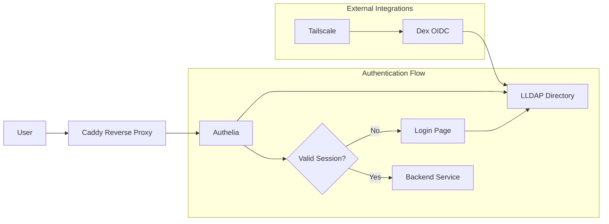
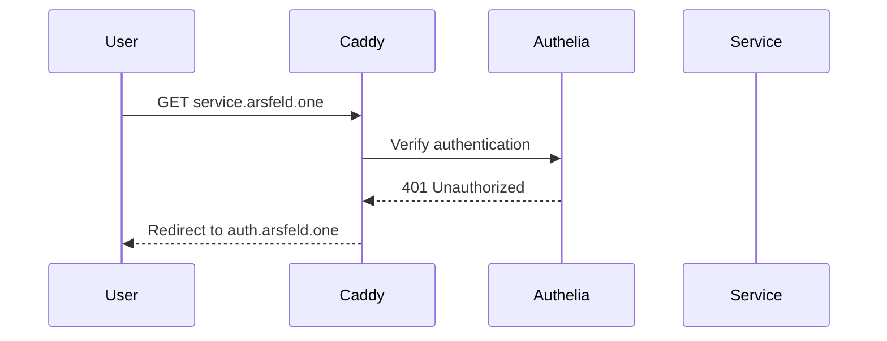
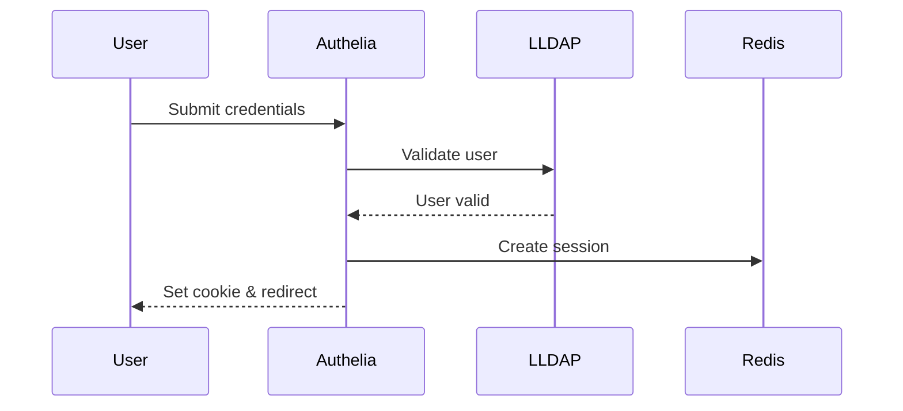
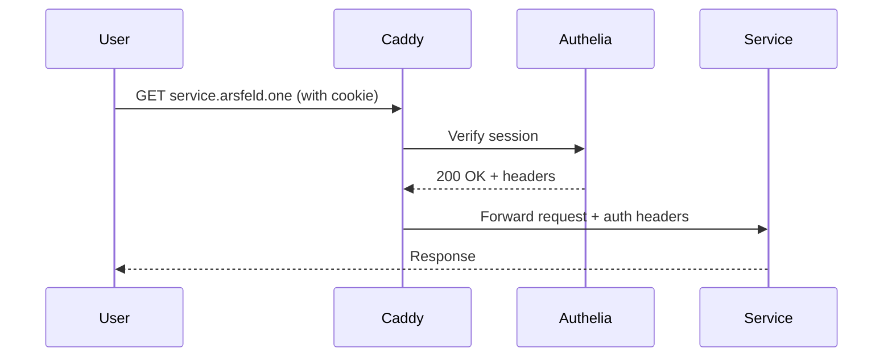

# Authentication System

## Overview

The authentication system provides Single Sign-On (SSO) across all services using a combination of LLDAP for user management, Dex for OIDC, and Authelia for the authentication portal.

## Components



## LLDAP (Lightweight LDAP)

LLDAP serves as the central user directory:

### Configuration
- **Base DN**: `dc=rosenfeld,dc=one`
- **Admin User**: `uid=admin,ou=people,dc=rosenfeld,dc=one`
- **User OU**: `ou=people,dc=rosenfeld,dc=one`
- **Group OU**: `ou=groups,dc=rosenfeld,dc=one`
- **Web Interface**: https://users.arsfeld.one

### User Management
Users are stored with standard LDAP attributes:
- `uid`: Username
- `mail`: Email address
- `cn`: Common name
- `displayName`: Display name
- `objectClass`: person, inetOrgPerson

### Group Management
Groups use the `groupOfUniqueNames` object class:
- Groups can control access to services
- Members linked via `member` attribute
- Integrated with Authelia access rules

## Dex (OIDC Provider)

Dex provides OpenID Connect authentication:

### LDAP Connector
```yaml
type: ldap
config:
  host: cloud.bat-boa.ts.net:3890
  bindDN: uid=admin,ou=people,dc=rosenfeld,dc=one
  userSearch:
    baseDN: ou=people,dc=rosenfeld,dc=one
    filter: "(objectClass=person)"
    username: uid
    idAttr: uid
    emailAttr: mail
    nameAttr: displayName
  groupSearch:
    baseDN: ou=groups,dc=rosenfeld,dc=one
    filter: "(objectClass=groupOfUniqueNames)"
    userMatchers:
      - userAttr: DN
        groupAttr: member
    nameAttr: cn
```

### OAuth2 Clients
- **Tailscale**: OAuth integration for network access
- Additional clients can be configured for new services

### Issuer Configuration
- **Issuer URL**: https://rosenfeld.one
- **Discovery**: https://rosenfeld.one/.well-known/openid-configuration

## Authelia

Authelia provides the authentication portal and session management:

### Features
- **Multi-factor Authentication**: TOTP support
- **Remember Me**: Extended sessions up to 1 month
- **Session Management**: Redis-backed sessions
- **Access Control**: Fine-grained authorization rules

### Session Configuration
```yaml
session:
  domain: arsfeld.one
  expiration: 7d            # Session duration
  inactivity: 45m          # Inactivity timeout
  remember_me_duration: 1M  # Remember me duration
```

### Access Control Rules

Default policy is `one_factor` (password only). Specific bypasses for:

#### API Endpoints
- Transmission RPC: `/transmission/rpc`
- *arr Services: `/api/*` endpoints
- Prowlarr: `/api`, `/download`
- FlareSolverr: `/v1/*`
- Yarr Fever: `/fever/*`

#### Streaming
- Stash: `/scene/*/stream`
- Media files: Direct access for playback

## Caddy Integration

Caddy enforces authentication via forward_auth:

```caddyfile
forward_auth cloud.bat-boa.ts.net:443 {
    uri /api/verify?rd=https://auth.arsfeld.one/
    copy_headers Remote-User Remote-Groups Remote-Name Remote-Email
}
```

### Authentication Headers
Services receive user information via headers:
- `Remote-User`: Username
- `Remote-Groups`: User's groups
- `Remote-Name`: Display name
- `Remote-Email`: Email address

### Service Configuration
Services can bypass authentication by setting `bypassAuth: true` in the constellation services module.

## Authentication Flow

### 1. Initial Access


### 2. Login Process


### 3. Authenticated Access


## Service Integration Examples

### Grafana
```nix
env.GF_AUTH_PROXY_ENABLED = "true";
env.GF_AUTH_PROXY_HEADER_NAME = "X-Tailscale-User";
env.GF_AUTH_PROXY_HEADER_PROPERTY = "username";
env.GF_AUTH_PROXY_AUTO_SIGN_UP = "true";
```

### Custom Applications
Applications can read authentication headers:
- `Remote-User` for username
- `Remote-Email` for email
- `Remote-Groups` for authorization

## Security Considerations

1. **HTTPS Only**: All authentication traffic encrypted
2. **Secure Cookies**: httpOnly, secure, sameSite flags
3. **Session Validation**: Each request verified
4. **LDAP Bind**: Secure connection to directory
5. **Secret Storage**: Passwords in agenix encryption

## Troubleshooting

### Common Issues

1. **Login Loop**: Check Redis connectivity and session configuration
2. **Group Access**: Verify LDAP group membership
3. **Service Bypass**: Ensure bypass rules match exact paths
4. **Header Issues**: Check Caddy is copying auth headers

### Debug Commands
```bash
# Test LDAP connection
ldapsearch -H ldap://cloud.bat-boa.ts.net:3890 \
  -D "uid=admin,ou=people,dc=rosenfeld,dc=one" \
  -W -b "dc=rosenfeld,dc=one"

# Check Authelia logs
journalctl -u authelia -f

# Verify Redis sessions
redis-cli --scan --pattern 'authelia*'
```