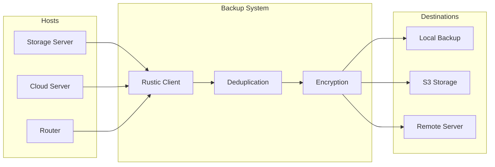

# Backup Strategy

## Overview

The backup system provides automated, encrypted, and versioned backups of all critical data across the infrastructure. Using Rustic (Restic-compatible), backups are deduplicated and stored in multiple locations.

## Backup Architecture



## Backup Configuration

### Rustic Module

```nix
# modules/constellation/backup.nix
services.rustic.backups = {
  system = {
    # What to backup
    paths = [
      "/etc"
      "/home"
      "/var/lib"
      "/mnt/data"
    ];
    
    # What to exclude
    exclude = [
      "/var/lib/containers/storage/overlay"
      "*.tmp"
      ".cache"
      "node_modules"
    ];
    
    # When to backup
    timerConfig = {
      OnCalendar = "weekly";
      Persistent = true;
    };
    
    # Where to backup
    repositories = [
      {
        name = "local";
        path = "/mnt/backups/rustic";
      }
      {
        name = "s3";
        path = "s3:s3.amazonaws.com/backup-bucket";
      }
    ];
  };
};
```

## Backup Locations

### 1. Local Backup (Fast Recovery)
- **Location**: `/mnt/backups` on storage server
- **Purpose**: Quick restoration
- **Retention**: 4 weeks
- **Size**: ~500GB

### 2. S3-Compatible Storage (Cottage)
- **Location**: Self-hosted S3 at cottage
- **Purpose**: Off-site backup
- **Retention**: 3 months
- **Size**: ~1TB

### 3. Cloud Storage (IDrive)
- **Location**: IDrive e2 via rclone
- **Purpose**: Last resort backup
- **Retention**: 1 year
- **Size**: ~2TB

## Backup Schedule

### Daily Backups
- **Databases**: PostgreSQL, MySQL dumps
- **Configuration**: Service configs
- **User Data**: Documents, settings

### Weekly Backups
- **System Files**: /etc, /var/lib
- **Container Data**: Persistent volumes
- **Media Metadata**: Plex/Jellyfin databases

### Monthly Archives
- **Full System**: Complete backup
- **Verification**: Restore tests
- **Rotation**: Old backups pruned

## Data Classification

### Critical Data (Priority 1)
Must be backed up with multiple copies:
- User authentication data (LLDAP)
- Service configurations
- SSL certificates
- Database dumps
- Personal documents

### Important Data (Priority 2)
Regular backups with standard retention:
- Application data
- Container volumes
- System configurations
- Logs (selective)

### Replaceable Data (Priority 3)
Optional or excluded from backups:
- Media files (have separate backup)
- Cache directories
- Temporary files
- Build artifacts

## Encryption

### Age Encryption
All backups are encrypted using age:
```nix
age.secrets.backup-password = {
  file = ../secrets/backup-password.age;
};

services.rustic.backups.system = {
  passwordFile = config.age.secrets.backup-password.path;
};
```

### Key Management
- Backup passwords stored in agenix
- Recovery keys in secure location
- Key rotation every 6 months

## Retention Policy

### Automated Pruning
```nix
pruneOpts = [
  "--keep-daily 7"
  "--keep-weekly 4"
  "--keep-monthly 6"
  "--keep-yearly 2"
];
```

### Storage Management
- Local: Keep recent backups only
- Remote: Extended retention
- Archive: Long-term storage

## Restoration Procedures

### Quick Recovery (Local)
```bash
# List snapshots
rustic -r /mnt/backups/rustic snapshots

# Restore specific files
rustic -r /mnt/backups/rustic restore <snapshot> --target /tmp/restore

# Restore to original location
rustic -r /mnt/backups/rustic restore <snapshot> --target /
```

### Full System Recovery
1. Boot from NixOS ISO
2. Mount filesystems
3. Restore system backup
4. Rebuild NixOS configuration
5. Restore service data

### Service-Specific Recovery

#### Database Recovery
```bash
# PostgreSQL
psql -U postgres < /backup/postgresql_dump.sql

# MySQL
mysql < /backup/mysql_dump.sql

# Redis
redis-cli --rdb /backup/redis.rdb
```

#### Container Recovery
```bash
# Stop service
systemctl stop podman-servicename

# Restore data
rustic restore <snapshot> --include "/mnt/data/servicename"

# Start service
systemctl start podman-servicename
```

## Monitoring

### Backup Health Checks
- Daily verification of backup completion
- Weekly restore tests
- Monthly storage usage reports
- Alert on backup failures

### Metrics Tracked
- Backup size and growth
- Deduplication ratio
- Backup duration
- Restoration time

## Disaster Recovery Plan

### RTO/RPO Targets
- **RTO** (Recovery Time Objective): 4 hours
- **RPO** (Recovery Point Objective): 24 hours

### Recovery Priorities
1. **Network Infrastructure**: Router, DNS
2. **Authentication**: LLDAP, Authelia
3. **Core Services**: Databases, storage
4. **User Services**: Applications, media

### Recovery Scenarios

#### Single Service Failure
- Time: 15-30 minutes
- Process: Restore from local backup
- Impact: Minimal

#### Host Failure
- Time: 2-4 hours
- Process: Rebuild host, restore data
- Impact: Service downtime

#### Complete Infrastructure Loss
- Time: 8-24 hours
- Process: Rebuild from scratch using backups
- Impact: Extended downtime

## Best Practices

### Pre-Backup Hooks
```nix
services.rustic.backups.system = {
  preBackupScript = ''
    # Dump databases
    pg_dumpall > /var/backup/postgresql.sql
    
    # Stop services if needed
    systemctl stop critical-service
  '';
  
  postBackupScript = ''
    # Restart services
    systemctl start critical-service
    
    # Cleanup
    rm /var/backup/postgresql.sql
  '';
};
```

### Testing Procedures
1. Monthly restore tests
2. Verify backup integrity
3. Document recovery times
4. Update procedures as needed

### Security Considerations
- Encrypted at rest and in transit
- Access keys rotated regularly
- Backup locations geographically distributed
- Air-gapped archive copies

## Cost Analysis

### Storage Costs
- Local: $0 (existing infrastructure)
- S3 Cottage: $0 (self-hosted)
- IDrive: ~$5/month for 2TB

### Total Monthly Cost: <$10

## Future Improvements

### Planned Enhancements
1. **Incremental Database Backups**: More frequent database snapshots
2. **Immutable Backups**: Write-once storage for ransomware protection
3. **Automated Testing**: Daily restore verification
4. **Multi-Region**: Additional geographic locations

### Considerations
- Implement pull-based backups for better security
- Add backup encryption key escrow
- Create automated recovery runbooks
- Implement backup data lifecycle policies