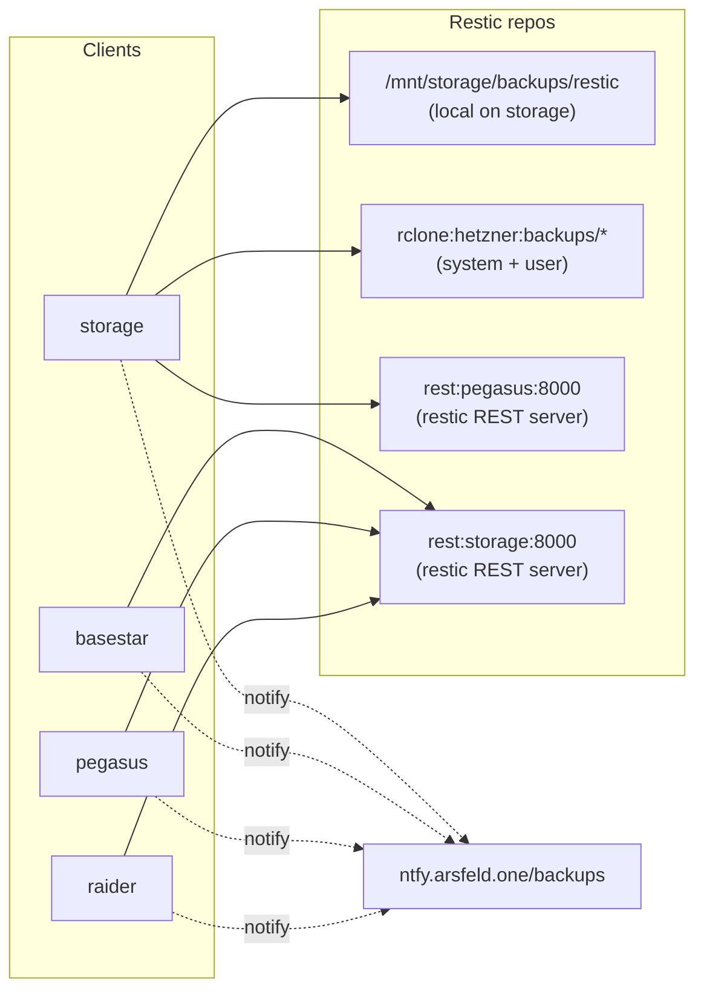

# Backup Strategy

## Overview

Every host that keeps state runs its own [Backrest](https://github.com/garethgeorge/backrest)
daemon — a web UI + scheduler wrapping `restic`. Repos are native
restic repos, so the tooling layer is swappable without reseeding.
Failures post to a single ntfy topic for a unified "did last night's
backups pass?" feed. A single Caddy vhost at
`https://backrest.arsfeld.one/` links to each host's Backrest UI.

## Topology


```mermaid
graph LR
    subgraph Clients
        Storage[storage]
        Basestar[basestar]
        Pegasus[pegasus]
        Raider[raider]
    end

    subgraph "Restic repos"
        NAS["/mnt/storage/backups/restic<br/>(local on storage)"]
        Hetzner["rclone:hetzner:backups/*<br/>(system + user)"]
        PegasusRest["rest:pegasus:8000<br/>(restic REST server)"]
        StorageRest["rest:storage:8000<br/>(restic REST server)"]
    end

    Storage --> NAS
    Storage --> Hetzner
    Storage --> PegasusRest
    Basestar --> StorageRest
    Pegasus --> StorageRest
    Raider --> StorageRest

    Storage -.notify.-> Ntfy[ntfy.arsfeld.one/backups]
    Basestar -.notify.-> Ntfy
    Pegasus -.notify.-> Ntfy
    Raider -.notify.-> Ntfy
```

## Hosts and plans

| Host     | Plans                                                     | Destinations |
|----------|-----------------------------------------------------------|--------------|
| storage  | `local-system`, `hetzner-system`, `hetzner`, `pegasus-system`, `pegasus` | local NAS, hetzner (×2), pegasus REST |
| basestar | `system` (daily)                                          | storage REST |
| pegasus  | `system` (weekly)                                         | storage REST |
| raider   | `system` (every 24h, interval scheduler for laptop)       | storage REST |

Snapshots on shared repos are distinguished by the restic `--host` tag,
driven by `constellation.backrest.instance` (defaults to the host's
`networking.hostName`).

## Module: `constellation.backrest`

A thin wrapper around the `backrest` package. Each host declares its
repos and plans; the module renders a `config.json` at deploy time
and installs it into `/var/lib/backrest/config.json` on service start.

```nix
# e.g. basestar
constellation.backrest = {
  enable = true;
  repos.storage = {
    uri = "rest:http://storage.bat-boa.ts.net:8000/";
    passwordFile = config.sops.secrets."restic-password".path;
  };
  plans.system = {
    repo = "storage";
    paths = ["/var/lib" "/home" "/root"];
    excludes = [ "/var/lib/docker" "/nix" "/mnt" "**/.cache" ];
    excludeIfPresent = [ ".nobackup" "CACHEDIR.TAG" ];
    schedule.cron = "30 3 * * *";
    retention = { daily = 7; weekly = 4; monthly = 6; };
  };
};
```

Source: `modules/constellation/backrest.nix`.

### Design notes

- **Runs as root.** Matches the prior `services.restic.backups` and
  `services.rustic` units. Needs read access to `/var/lib`, `/home`,
  `/root`, and (for storage's system plans) `/`.
- **Config mutated by daemon.** Backrest writes `modno` / `guid`
  fields at runtime, so the rendered config is installed into
  `/var/lib/backrest/config.json` rather than symlinked from the Nix
  store. Operators should treat the UI as read-only; retention or
  schedule changes go through Nix.
- **Internal scheduler.** Cron expressions (or `clock = "last-run"`
  for laptops) are evaluated inside the daemon. The nixpkgs module is
  bypassed; there are no per-plan systemd timers.
- **Restic binary pinned.** `BACKREST_RESTIC_COMMAND` points at
  `pkgs.restic/bin/restic` so the daemon never downloads its own
  binary into the state directory.
- **`pkgs-unstable.backrest`** tracks upstream releases faster than
  nixpkgs-stable.

## Trust model

- Backrest binds `0.0.0.0:9898` with the firewall opened only on
  `tailscale0`. Direct access from the tailnet requires a Tailscale
  ACL restricting `tcp:9898` to operator devices — configured in the
  Tailscale admin console, outside this repo.
- Backrest's built-in auth is disabled (`auth.disabled: true`).
- **Public access**. The unified `backrest.arsfeld.one` portal on
  storage's Caddy is an iframe shell that loads each host's UI from
  its own per-host subdomain (`backrest-<host>.arsfeld.one`). The
  portal vhost and every per-host subdomain are Authelia-gated. All
  four hosts (storage, basestar, pegasus, raider) are reachable from
  any browser regardless of client-side Tailscale state, eliminating
  the previous tailnet-only click-through.
  - Storage's Caddy reverse-proxies each subdomain to the upstream
    daemon over the tailnet (`<host>.bat-boa.ts.net:9898`). The
    daemons themselves still bind `tailscale0` only.
  - The portal vhost itself sets `frame-ancestors 'none'` /
    `X-Frame-Options: DENY`. Per-host subdomains set
    `frame-ancestors https://backrest.arsfeld.one`. Storage's Caddy
    strips any upstream `X-Frame-Options` so the CSP directive is
    the sole framing authority.
- **Single Authelia gate.** Defense-in-depth via Backrest's built-in
  auth was considered and rejected (see brainstorm R3). Authelia
  bypass equals restore/mutate access across the fleet — harden
  Authelia (2FA, lockout) before reintroducing weak per-host
  credentials.
- **Storage Caddy SPOF.** When storage is down, no host's Backrest
  UI is reachable publicly. Tailnet remains the recovery path.
- See `docs/brainstorms/2026-04-20-backrest-public-ui-portal-brainstorm.md`
  and `docs/plans/2026-04-20-002-feat-backrest-public-ui-portal-plan.md`
  for the full design rationale.

## Repositories

All repos share the `restic-password` secret from `common.yaml`.
Multi-writer compromise exposes the full snapshot graph on any
shared repo; the three-copy topology (local NAS + hetzner + pegasus
REST) is the mitigation.

| Repo name        | URI                                                | Owner    | Notes |
|------------------|----------------------------------------------------|----------|-------|
| `local-system`   | `/mnt/storage/backups/restic`                      | storage  | Local, daily |
| `hetzner-system` | `rclone:hetzner:backups/restic-system`             | storage  | rclone creds via `hetzner-webdav-env` |
| `hetzner`        | `rclone:hetzner:backups/restic`                    | storage  | rclone creds via `hetzner-webdav-env` |
| pegasus REST     | `rest:http://pegasus.bat-boa.ts.net:8000/`         | storage  | two plans share the URI; `pegasus-system` + `pegasus` (user data) |
| storage REST     | `rest:http://storage.bat-boa.ts.net:8000/`         | basestar, pegasus, raider | multi-writer; `--host` tag distinguishes snapshots |

The two REST servers (`services.restic.server` on storage and
pegasus) stay `--no-auth` on Tailscale. They accept any authenticated
tailnet peer; the repo password is the encryption boundary.

## Notifications

Every plan fires a shell hook on `CONDITION_ANY_ERROR` and
`CONDITION_SNAPSHOT_ERROR`. The hook POSTs to
`https://ntfy.arsfeld.one/backups` with an `Authorization: Basic`
header built from `NTFY_BASIC_AUTH_B64` (loaded from the
`ntfy-publisher-env` sops secret). Body includes hostname, repo id,
plan id, and the restic error.

Phase A does **not** send success notifications. Operators confirm
green state via the Backrest UI on demand. If "silently stopped
backing up" becomes a real failure mode, add a scheduled heartbeat
then — don't pre-build for it.

## Retention

Defaults carried over from the prior restic config:

- **Remote weekly plans** (`hetzner*`, `pegasus*`, basestar, pegasus,
  raider): `--keep-daily 7 --keep-weekly 4 --keep-monthly 6`.
- **local-system plan** (daily): `--keep-daily 7 --keep-weekly 5
  --keep-monthly 12`.

Retention changes go through Nix; UI edits are lost on next deploy.

## Restore

No automation. Use `restic` against the relevant repo directly:

```bash
# Example: list snapshots from basestar's backups on storage's repo
restic -r rest:http://storage.bat-boa.ts.net:8000/ snapshots --host basestar

# Restore to /tmp/restore
restic -r rest:http://storage.bat-boa.ts.net:8000/ restore <snapshot> --target /tmp/restore
```

The Backrest UI also has a per-snapshot "Restore" action that calls
`restic restore` under the hood.

Restore drills are a manual exercise; no scheduled test. See
`docs/plans/2026-04-20-001-feat-unify-backups-under-backrest-plan.md`
"Phase B" for aspirations (automated monthly drills, cross-host
integrity reports).

## Secrets

- `restic-password` (common.yaml) — all repos.
- `hetzner-webdav-env` (storage.yaml) — rclone creds for the hetzner
  repos; loaded as `EnvironmentFile=` on the Backrest unit on storage.
- `ntfy-publisher-env` — publisher credential for the failure hook;
  shared across hosts via `secrets/sops/ntfy-client.yaml`.
