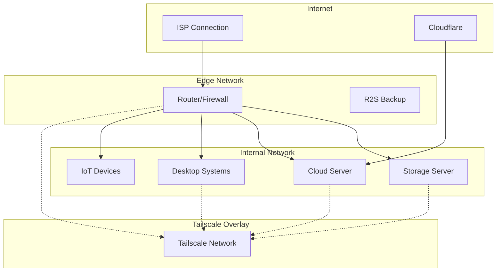
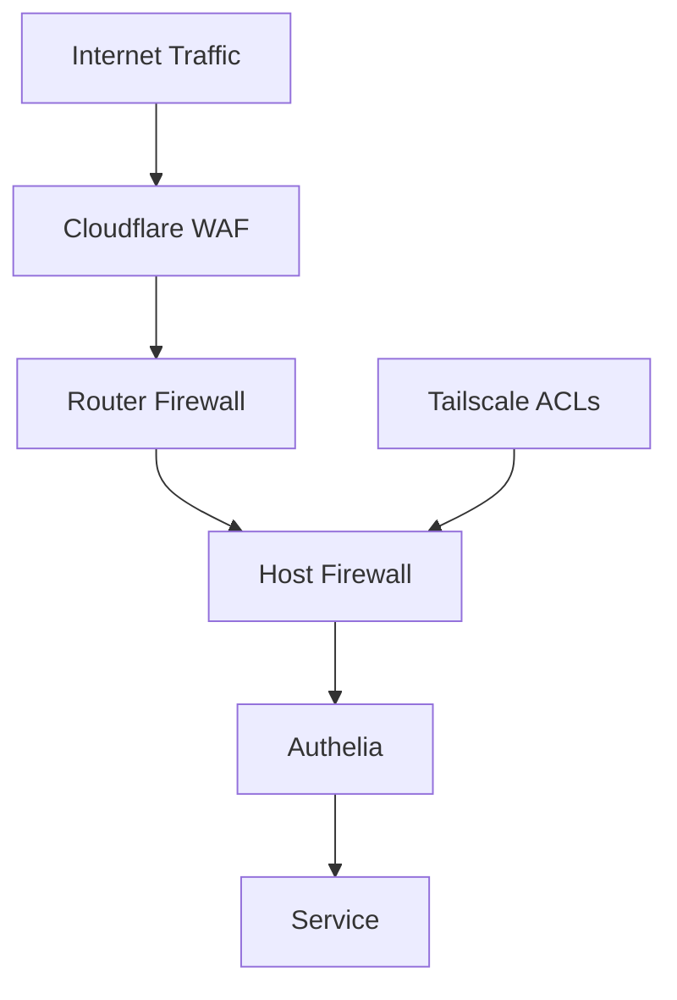

# Network Architecture

## Overview

The network architecture provides secure, efficient communication between all infrastructure components using a combination of Tailscale VPN, traditional networking, and reverse proxy services.

## Network Topology



## Network Layers

### 1. Physical Network

#### LAN Configuration
- **Network**: 192.168.1.0/24 (typical home network)
- **Gateway**: Router at 192.168.1.1
- **DHCP**: Managed by router for client devices
- **Speed**: 1Gb/10Gb Ethernet depending on device

#### VLAN Segmentation (Future)
```
VLAN 10: Management
VLAN 20: Services
VLAN 30: IoT Devices
VLAN 40: Guest Network
```

### 2. Tailscale Overlay Network

#### Configuration
```nix
services.tailscale = {
  enable = true;
  useRoutingFeatures = "both";
  extraUpFlags = ["--ssh" "--accept-routes"];
};
```

#### Network Details
- **Subnet**: 100.x.x.x/32 (Tailscale-assigned)
- **DNS Suffix**: .bat-boa.ts.net
- **Features**:
  - MagicDNS for hostname resolution
  - SSH access via Tailscale SSH
  - Exit node capability
  - Subnet routing

#### Access Control Lists (ACLs)
```json
{
  "groups": {
    "group:admin": ["user@example.com"],
    "group:users": ["user2@example.com"]
  },
  "acls": [
    {
      "action": "accept",
      "src": ["group:admin"],
      "dst": ["*:*"]
    },
    {
      "action": "accept",
      "src": ["group:users"],
      "dst": ["tag:services:80,443"]
    }
  ]
}
```

### 3. Service Networking

#### Reverse Proxy (Caddy)
All HTTP(S) traffic flows through Caddy:

```
Internet → Cloudflare → Caddy → Backend Service
                          ↓
                     Authelia (Auth Check)
```

#### Port Allocations

| Service Category | Port Range | Example |
|-----------------|------------|---------|
| Web Services | 8000-8999 | Plex: 8400 |
| Databases | 5000-5999 | PostgreSQL: 5432 |
| System Services | 9000-9999 | Netdata: 9090 |
| Media Services | 7000-7999 | Jellyfin: 7096 |

## DNS Architecture

### External DNS (Cloudflare)
```
*.arsfeld.one → Cloud Server IP
```

**Features:**
- DDoS protection
- CDN caching
- SSL termination
- Geographic routing

### Internal DNS (Blocky)

Configuration:
```yaml
upstream:
  default:
    - https://dns.cloudflare.com/dns-query
    - https://dns.google/dns-query

blocking:
  blackLists:
    ads:
      - https://someonewhocares.org/hosts/zero/hosts
      - https://s3.amazonaws.com/lists.disconnect.me/simple_ad.txt

customDNS:
  mapping:
    storage.lan: 192.168.1.10
    cloud.lan: 192.168.1.11
```

### mDNS/Avahi
Local service discovery:
```nix
services.avahi = {
  enable = true;
  nssmdns = true;
  publish = {
    enable = true;
    addresses = true;
    workstation = true;
  };
};
```

## Firewall Configuration

### Router Firewall

#### Inbound Rules
```nix
# Only allow specific services
networking.firewall.allowedTCPPorts = [
  80    # HTTP (redirect to HTTPS)
  443   # HTTPS
  22    # SSH (Tailscale only)
];

# Port forwarding
networking.nat.forwardPorts = [
  {
    destination = "192.168.1.11:443";  # Cloud server
    proto = "tcp";
    sourcePort = 443;
  }
];
```

#### Outbound Rules
- Allow all outbound by default
- Block specific ports for security
- QoS for media streaming

### Host-Level Firewalls

Each host runs nftables with:
```nix
networking.firewall = {
  enable = true;
  
  # Tailscale interface is always trusted
  trustedInterfaces = [ "tailscale0" ];
  
  # Service-specific ports
  allowedTCPPorts = [ ... ];
  
  # Reject instead of drop for faster failures
  rejectPackets = true;
};
```

## Network Security

### Zero-Trust Principles

1. **Never Trust, Always Verify**
   - All services require authentication
   - Network location doesn't grant access

2. **Least Privilege**
   - Services only expose required ports
   - ACLs limit access by user/group

3. **Encryption Everywhere**
   - TLS for all web services
   - WireGuard for VPN traffic
   - SSH for management

### Security Layers



## Performance Optimization

### Network Tuning

#### System Parameters
```nix
boot.kernel.sysctl = {
  # Network performance
  "net.core.rmem_max" = 134217728;
  "net.core.wmem_max" = 134217728;
  "net.ipv4.tcp_rmem" = "4096 87380 134217728";
  "net.ipv4.tcp_wmem" = "4096 65536 134217728";
  
  # Connection handling
  "net.core.netdev_max_backlog" = 5000;
  "net.ipv4.tcp_congestion" = "bbr";
};
```

#### Quality of Service (QoS)
Priority queues for different traffic types:
1. **High**: VoIP, gaming
2. **Medium**: Streaming media
3. **Low**: Bulk downloads, backups

### CDN Integration

Cloudflare caching rules:
```
Cache Everything: /static/*
Cache Level: Standard
TTL: 1 month for assets
```

## Monitoring

### Network Metrics

#### Netdata Monitoring
- Bandwidth usage per interface
- Connection counts
- Packet loss and errors
- Latency measurements

#### Traffic Analysis
```bash
# Real-time traffic monitoring
iftop -i eth0

# Connection tracking
ss -tuln

# Bandwidth testing
iperf3 -s  # Server mode
iperf3 -c storage.bat-boa.ts.net  # Client test
```

### Alerting

Network-related alerts:
- High bandwidth usage (>80%)
- Packet loss >1%
- Latency spikes >100ms
- Failed DNS queries

## Troubleshooting

### Common Issues

#### Connectivity Problems
```bash
# Test Tailscale connectivity
tailscale ping storage

# Check DNS resolution
dig storage.bat-boa.ts.net

# Trace route
mtr cloud.arsfeld.one
```

#### Performance Issues
```bash
# Check interface statistics
ip -s link show

# Monitor connections
netstat -tuln

# Check firewall logs
journalctl -u nftables -f
```

## Future Improvements

### IPv6 Support
- Full dual-stack implementation
- IPv6-only services
- Improved routing

### Network Segmentation
- VLAN implementation
- Microsegmentation for services
- Enhanced isolation

### Advanced Routing
- Multi-WAN failover
- Policy-based routing
- Traffic shaping per service