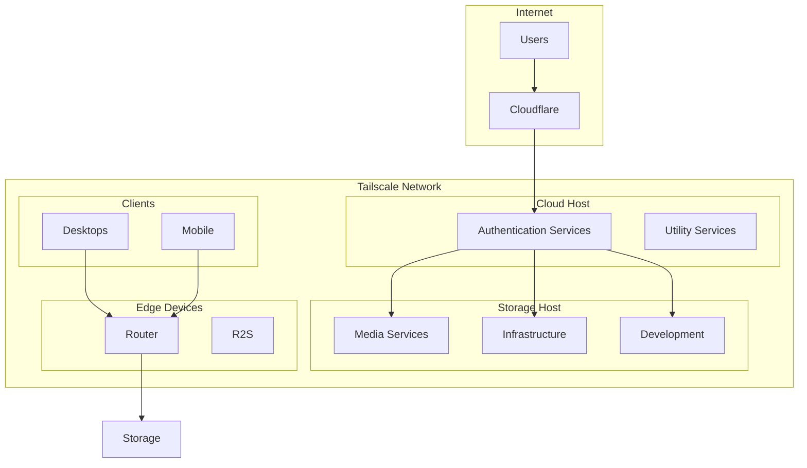

# Architecture Overview

## System Design

This NixOS infrastructure follows a distributed architecture pattern with specialized hosts serving different purposes. The design emphasizes modularity, security, and maintainability.

## Core Principles

### 1. **Declarative Configuration**
Everything is defined in Nix, ensuring reproducibility and version control for the entire infrastructure.

### 2. **Modular Design**
The constellation module system allows features to be enabled selectively on different hosts.

### 3. **Zero-Trust Networking**
All inter-host communication happens over Tailscale VPN with WireGuard encryption.

### 4. **Container Isolation**
Services run in Podman containers when possible for better security and resource isolation.

## Infrastructure Components



## Host Roles

### **Storage Server** (`storage`)
The primary server hosting most services:
- Media streaming and management
- File storage and synchronization
- Development tools
- Monitoring infrastructure
- Backup coordination

### **Cloud Server** (`cloud`)
Public-facing services requiring high availability:
- Authentication services (LLDAP, Dex, Authelia)
- Communication tools
- Public websites
- API endpoints

### **Router** (`router`)
Network edge device:
- Main internet gateway
- DNS server (Blocky)
- VPN endpoint
- Traffic shaping

### **Desktop Systems**
Personal workstations with:
- Development environments
- Gaming configurations
- Media consumption

## Technology Stack

| Layer | Technology | Purpose |
|-------|------------|---------|
| **OS** | NixOS | Declarative Linux distribution |
| **Configuration** | Nix Flakes | Reproducible system configs |
| **Containers** | Podman | OCI container runtime |
| **Networking** | Tailscale | Mesh VPN |
| **Reverse Proxy** | Caddy | HTTPS and authentication |
| **Authentication** | LLDAP + Dex + Authelia | SSO and access control |
| **Monitoring** | Netdata + Grafana | System metrics |
| **Backup** | Rustic | Encrypted deduplicated backups |
| **Secrets** | Agenix | Age-encrypted secrets |
| **Deployment** | Deploy-rs | Remote deployment tool |

## Configuration Hierarchy

```
flake.nix                    # Root configuration
├── modules/
│   └── constellation/       # Shared module system
│       ├── common.nix      # Base configuration
│       ├── services.nix    # Service registry
│       └── ...
├── hosts/
│   ├── storage/            # Host-specific config
│   │   ├── configuration.nix
│   │   └── services/
│   └── ...
└── home/                   # User environment
```

## Service Architecture

Services follow a consistent pattern:

1. **Definition**: Service defined in constellation modules
2. **Configuration**: Host-specific settings in host directories
3. **Secrets**: Encrypted with agenix
4. **Networking**: Exposed via Caddy reverse proxy
5. **Authentication**: Protected by Authelia (unless bypassed)
6. **Monitoring**: Metrics collected by Netdata

## Network Architecture

### External Access
1. Public DNS points to Cloudflare
2. Cloudflare proxies to origin servers
3. Caddy handles TLS termination
4. Services accessed via subdomains

### Internal Access
1. Tailscale provides mesh VPN
2. Direct host-to-host communication
3. No exposure to public internet
4. mDNS for local discovery

## Security Model

### Authentication Layers
1. **Tailscale**: Network-level access control
2. **Authelia**: Application-level SSO
3. **Service-specific**: Additional auth when needed

### Secret Management
- Secrets encrypted with age
- Decrypted at runtime
- Never stored in plain text
- Separate keys per host

### Network Security
- All external traffic through Cloudflare
- Tailscale for internal communication
- Firewall rules on each host
- Service isolation via containers