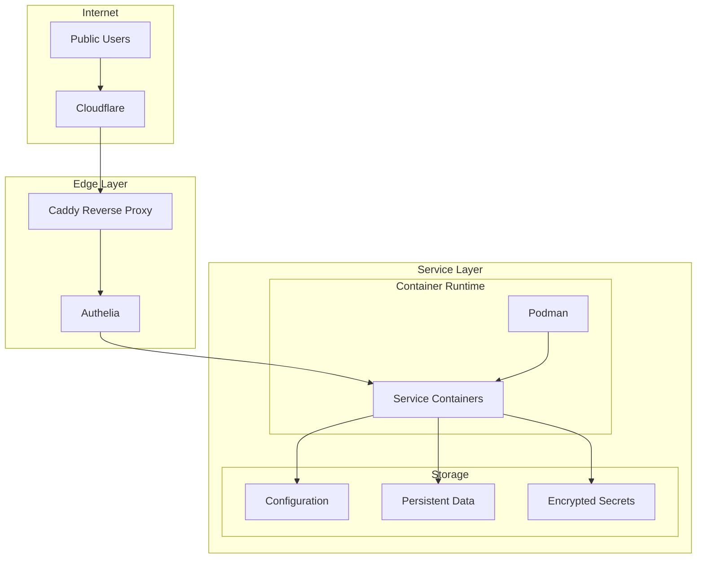
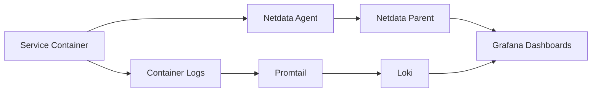

# Service Architecture

## Overview

Services in this infrastructure follow a consistent architecture pattern using containers, reverse proxy, and unified authentication. The constellation services module acts as a service registry, defining how services are deployed and accessed.

## Service Categories

### Media Services
Comprehensive media management and streaming:
- **Streaming**: Plex, Jellyfin, Navidrome, Stash
- **Management**: Sonarr, Radarr, Lidarr, Readarr
- **Search**: Prowlarr, Jackett
- **Download**: SABnzbd, qBittorrent, Transmission
- **Subtitles**: Bazarr, OpenSubtitles

### Infrastructure Services
Core infrastructure and monitoring:
- **Monitoring**: Netdata, Grafana, Prometheus, Beszel
- **Storage**: Scrutiny (disk health), Homepage (dashboard)
- **DNS**: Blocky (ad-blocking DNS)
- **Backup**: Rustic scheduled backups

### Development Tools
Software development and automation:
- **Git**: Gitea (self-hosted Git)
- **IDE**: Code-server (VS Code in browser)
- **CI/CD**: Drone, Act runner
- **Automation**: N8N workflows

### Communication
Messaging and notifications:
- **Chat**: Mattermost
- **Push**: Ntfy (push notifications)
- **RSS**: Yarr (RSS reader)

### File Management
File storage and synchronization:
- **Cloud Storage**: Nextcloud, Seafile
- **Sync**: Syncthing
- **Sharing**: FileBrowser, PairDrop

## Service Definition

Services are defined in the constellation services module:

```nix
{
  services = {
    plex = {
      host = "storage";
      port = 32400;
      public = true;
      bypassAuth = false;
      tailscaleFunnel = false;
    };
  };
}
```

### Service Properties

| Property | Type | Description |
|----------|------|-------------|
| `host` | string | Host where service runs |
| `port` | integer | Service port number |
| `public` | boolean | Publicly accessible via internet |
| `bypassAuth` | boolean | Skip authentication |
| `tailscaleFunnel` | boolean | Expose via Tailscale Funnel |

## Deployment Architecture



## Container Management

### Podman Configuration
Services run in rootless Podman containers:
- Auto-update enabled via systemd timers
- Networking via podman-bridge
- Volume mounts for persistent data

### Container Definitions
Media services use a custom container module:
```nix
virtualisation.oci-containers.containers = {
  service-name = {
    image = "docker.io/org/image:tag";
    ports = ["8080:8080"];
    volumes = [
      "/data/service:/config"
      "/media:/media"
    ];
    environment = {
      PUID = "1000";
      PGID = "1000";
    };
  };
};
```

## Networking

### Reverse Proxy Configuration
Caddy handles all HTTP(S) traffic:

```caddyfile
service.arsfeld.one {
  forward_auth cloud.bat-boa.ts.net:443 {
    uri /api/verify?rd=https://auth.arsfeld.one/
  }
  reverse_proxy storage.bat-boa.ts.net:8080
}
```

### Service Discovery
Services register in constellation module:
1. Service defined with host/port
2. Caddy generates configuration
3. DNS wildcard points to Caddy
4. Automatic HTTPS via Let's Encrypt

### Network Paths

#### Public Access
```
Internet → Cloudflare → Caddy → Authelia → Service
```

#### Internal Access
```
Tailscale Client → Service Host → Container
```

## Data Management

### Persistent Storage
```
/mnt/
├── data/           # Service data
│   ├── plex/
│   ├── jellyfin/
│   └── ...
├── media/          # Media files
│   ├── movies/
│   ├── tv/
│   └── music/
└── backups/        # Backup destination
```

### Configuration Storage
- Service configs in `/mnt/data/service-name`
- Secrets encrypted with agenix
- Environment variables for runtime config

## Monitoring and Logging

### Metrics Collection


### Health Checks
- Netdata: Real-time metrics
- Beszel: Service availability
- Homepage: Status dashboard
- Scrutiny: Disk health

## Service Integration Patterns

### Authentication Integration
Services integrate with SSO via:
1. **Header Authentication**: Read auth headers from Caddy
2. **OIDC**: Direct integration with Dex
3. **API Keys**: For service-to-service communication

### Inter-Service Communication
```nix
# Example: Sonarr → SABnzbd
services.sonarr.environment = {
  SABNZBD_API_KEY = "@SABNZBD_API_KEY@";
  SABNZBD_URL = "http://storage.bat-boa.ts.net:8080";
};
```

### Shared Resources
- Media files via NFS/SMB
- Database connections
- Message queues
- Shared authentication

## Service Lifecycle

### Deployment Process
1. Define service in constellation module
2. Configure container in host configuration
3. Add secrets to agenix
4. Deploy with `just deploy hostname`
5. Verify via monitoring

### Update Process
1. Automatic image updates via Podman
2. Configuration changes via Nix
3. Rolling updates for zero downtime
4. Backup before major changes

### Backup Integration
Services backed up weekly:
- Configuration directories
- Database dumps
- Exclusions for cache/temp files
- Multiple backup destinations

## High Availability Patterns

### Service Distribution
- Critical services on multiple hosts
- Load balancing via Caddy
- Failover via health checks

### Data Redundancy
- Bcachefs redundant storage
- Off-site backup copies
- Database replication

### Disaster Recovery
- Automated backup restoration
- Infrastructure as code
- Quick service recreation