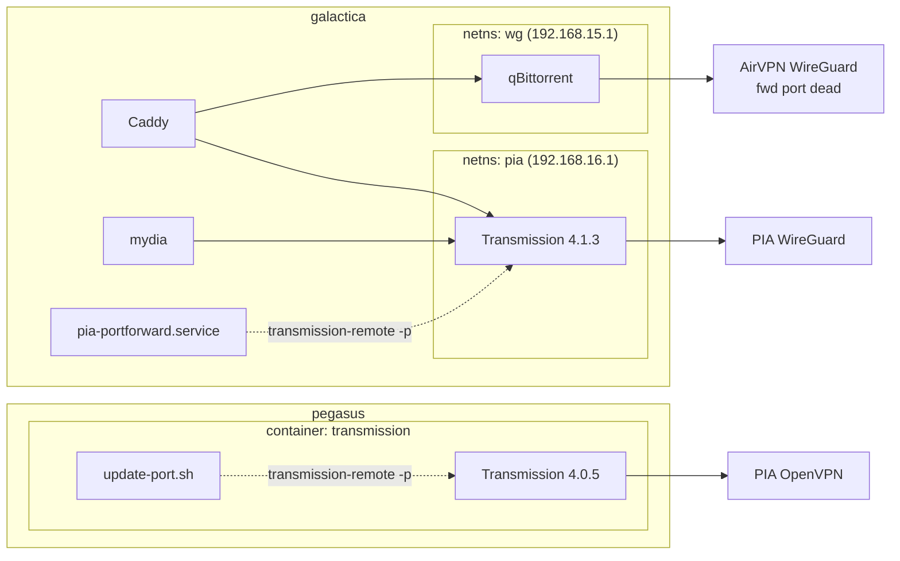

# VPN-Confined Torrent Stack

## Overview

Every torrent client is confined to a VPN tunnel so no swarm ever sees a home or
datacenter IP, and each one listens on a **dynamically forwarded port** obtained
from PIA's port-forwarding API. Without a forwarded port a client can still
download, but it cannot accept inbound peers — which cripples seeding and hurts
poorly-seeded torrents.

galactica and pegasus solve the same problem two different ways, for historical
reasons rather than by design:

| | galactica | pegasus |
|---|---|---|
| Client | Transmission 4.1.3, native `services.transmission` | Transmission 4.0.5, `haugene/transmission-openvpn` |
| Tunnel | PIA **WireGuard**, host netns via VPN-Confinement | PIA **OpenVPN**, inside the container |
| Confinement | `constellation.pia` (`modules/constellation/pia.nix`) | image's kill switch (`LOCAL_NETWORK` bypass only) |
| Port forwarding | `constellation.pia` consumer hook + `ExecStartPost` | `/etc/openvpn/pia/update-port.sh` in the image |
| Reached by mydia | `192.168.16.1:9091` (namespace IP) | `localhost:9091` |
| RPC auth | none (namespace-isolated) | required, creds in sops |
| Web UI | Flood, `transmission.arsfeld.one` | Flood, `transmission.arsfeld.xyz` |

galactica additionally still runs **qBittorrent** in a separate AirVPN
namespace (`wg`, `192.168.15.1:8080`). That namespace's static forward on
port 30158 no longer answers from outside — inbound TCP simply times out — which
is why Transmission was moved off it and onto PIA.

## Topology



## PIA port forwarding

Both hosts run the same PIA API flow; only the implementation language differs.

1. **`generateToken`** — exchange the PIA account credentials for a token.
2. **`getSignature`** at `https://<pf_gateway>:19999` — returns a base64 payload
   containing the assigned port and an `expires_at`. The reservation is valid for
   ~60 days; the port is chosen by PIA, not by us.
3. **`bindPort`** with that payload+signature — **must be repeated at least every
   15 minutes** or PIA drops the binding.
4. **Apply the port to the client.** Transmission takes it over RPC
   (`transmission-remote -p`), so this needs no restart and does not interrupt
   running torrents.

`constellation.pia` (galactica) implements steps 1–3 in Python
(`pia portforward`, driven by `pia-portforward.service` + a 15-minute timer),
caches the signature in `/var/lib/pia/state.json`, and publishes the bare port to
the world-readable `/run/pia/forwarded-port`. Consumers attach through the
`constellation.pia.consumers.<name>` seam and receive the port in
`$PIA_FORWARDED_PORT`.

haugene (pegasus) implements the same in bash. The updater is launched from
`/etc/transmission/start.sh` immediately after the daemon, gated on nothing more
than the provider name:

```bash
if [[ -f /etc/openvpn/${OPENVPN_PROVIDER,,}/update-port.sh && (-z $DISABLE_PORT_UPDATER || "false" = "$DISABLE_PORT_UPDATER") ]]; then
  exec /etc/openvpn/${OPENVPN_PROVIDER,,}/update-port.sh &
fi
```

so it is **on by default** for `OPENVPN_PROVIDER=PIA`, opt out with
`DISABLE_PORT_UPDATER=true`. It discovers the PF gateway by scraping the routing
table (`ip route | grep tun | grep -v src | head -1 | awk '{print $3}'`) rather
than from the API.

### Why galactica applies the port twice

The peer port is fed to Transmission from two directions, through one shared
script. Neither alone is sufficient:

- **`onPortChange`** handles the port actually changing.
- **`ExecStartPost`** handles startup, reading `/run/pia/forwarded-port`. This is
  **required**, because the NixOS transmission module regenerates `settings.json`
  from the declarative `settings` on *every* start — so any live port set via RPC
  is wiped on restart, and the change hook won't re-fire if PIA's port hasn't
  changed.

The hook only touches RPC, never systemd. This matters: the predecessor client
(rqbit) had no runtime port API, so a port change meant a full `systemctl
restart` dispatched from inside `pia-portforward`'s own `ExecStart` — which had
to use `--no-block` purely to avoid deadlocking against the unit it depended on.
Transmission removes that whole class of problem.

## Gotchas

Things that cost real debugging time. Most fail *silently* — the port looks
bound in every status readout while no peer can actually reach it.

### The namespace firewall is wiped on every `<ns>.service` restart

`pia-up` recreates the netns from scratch, so its firewall rules go with it —
but `applied_port` survives in `/var/lib/pia/state.json`. `iptables_ensure()` was
originally gated behind "the port changed", so after any restart with an
unchanged port the tunnel-side ACCEPT rule for the peer port was never restored
and the port stayed closed to inbound peers.

Fixed by calling `iptables_ensure()` unconditionally on every rebind — it already
does a `-C` check before `-A`, so re-running it is free. **When adding state to
this module, assume the namespace can vanish under you and reconcile every run
rather than trusting cached state.**

### `settings.json` is stale while the daemon is running

Transmission only writes `settings.json` on exit. Reading the file from a running
container reports whatever the port was at last shutdown. This produced a
completely wrong conclusion about pegasus once — the file said 59334 while the
live port was 35344 and working fine.

**Always query the live port over RPC**, never the file.

### `transmission-remote -pt` gives false negatives

On galactica the built-in port test reports `Couldn't test port: No Response (0)`
while the port is verifiably open. Trust an external check instead:

```bash
# from another host — authoritative
nc -zv <vpn-exit-ip> <forwarded-port>

# or ask transmissionbt's checker from inside the namespace (1 = open)
ip netns exec pia curl -s https://portcheck.transmissionbt.com/<port>
```

Note the VPN exit IP changes whenever `pia-connect` re-runs, so re-read it
(`ip netns exec pia curl -s https://api.ipify.org`) before probing — probing a
stale IP looks exactly like a closed port.

### Never map the same host port into two namespaces

VPN-Confinement installs DNAT rules on `PREROUTING` per namespace. Two namespaces
mapping the same host port produce conflicting rules. When Transmission moved
from `wg` to `pia`, port 9091 had to be removed from `qbittorrent-vpn.nix`'s
`portMappings` *and* from its `wg-up` DNAT/INPUT overrides.

### Loopback bypasses the DNAT rules

Anything on the host reaching a confined service must address the **namespace IP**
(`192.168.16.1`), not `localhost` — `PREROUTING` doesn't apply to
loopback-originated traffic. This is why both Caddy and the host-networked mydia
container are configured with `pia.namespaceAddress` rather than `localhost`.

### A namespace-changing deploy may need a follow-up restart

Activation stops and starts `pia.service` in the same batch as the units living
inside the namespace. That race can leave the *old* namespace in place with the
*old* port rules, while every unit reports active. Symptom: the rules reference a
port from the previous config. Fix:

```bash
systemctl restart pia.service
```

### Upstream quirks worth knowing

- **VPN-Confinement hardcodes `fd93:9701:1d00::1/64`** for *every* namespace
  bridge, so `wg-br` and `pia-br` both carry the same IPv6 address. The IPv6 DNAT
  path is therefore ambiguous. Nothing is broken today because Caddy and mydia
  address namespaces over IPv4 explicitly — but it is a landmine for anything that
  tries the IPv6 path.
- **haugene re-binds but does not re-apply.** Its steady-state 15-minute loop
  calls only `bind_port`; `bind_trans` runs solely at startup and on signature
  refresh. If Transmission restarted without the container restarting, the port
  would revert and never be re-applied. Pegasus escapes this only because the
  daemon and the updater share a container lifecycle.
- **haugene's `grep Listenport` is version-fragile.** Transmission 4.0.5 prints
  `Listenport:`; 4.1.3 prints `Listen port:` with a space. On a newer daemon the
  grep returns empty, so the comparison always fires and the port is re-set every
  invocation — noisy, but it fails in the safe direction.

## Verification runbook

```bash
# --- galactica ---
cat /run/pia/forwarded-port                       # port PIA assigned
ip netns exec pia ss -tlnp                        # transmission should listen on it
transmission-remote 192.168.16.1:9091 -si         # live listen port (not settings.json)
ip netns exec pia curl -s https://api.ipify.org   # current exit IP

# Namespace firewall. Note `iptables` is NOT on the host PATH — use nft, which
# also prints counters, so you can see inbound peers actually arriving on pia0.
ip netns exec pia nft list chain ip filter INPUT
#   expect: iifname "pia0"     tcp/udp dport <peer-port> ... accept
#           iifname "veth-pia" tcp      dport 9091       ... accept   (web UI)

# --- pegasus ---
podman logs transmission | grep "Reserved Port"   # updater's 15-min heartbeat
podman exec transmission sh -c \
  'transmission-remote localhost:9091 --auth $(head -1 /config/transmission-credentials.txt):$(tail -1 /config/transmission-credentials.txt) -si'

# --- either, from a third host: the authoritative inbound check ---
nc -zv <vpn-exit-ip> <forwarded-port>
```

## Related

- `modules/constellation/pia.nix` — the PIA namespace + port-forward control plane
- `hosts/galactica/services/transmission-vpn.nix` — galactica's Transmission
- `hosts/galactica/services/qbittorrent-vpn.nix` — the AirVPN `wg` namespace
- `hosts/pegasus/services/transmission.nix` — pegasus's containerized Transmission
- `docs/plans/2026-05-30-001-feat-pia-vpn-port-forwarding-plan.md` — original PIA design
