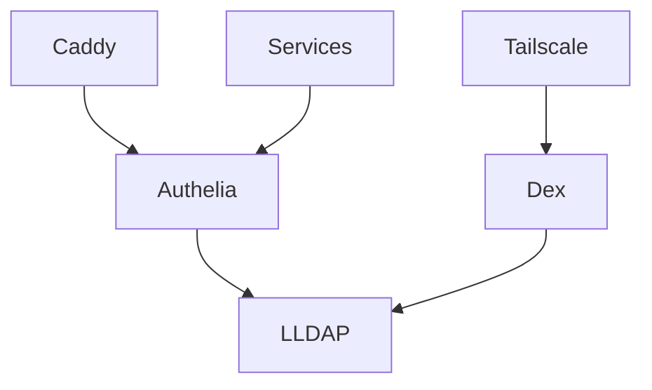

# Cloud Server

## Overview

The cloud server hosts all public-facing services and authentication infrastructure. It's a lightweight ARM64 virtual machine optimized for low resource usage while providing critical services.

## Hardware Specifications

### Virtual Machine
- **Platform**: KVM/QEMU ARM64 (aarch64)
- **Type**: Oracle Cloud Infrastructure Free Tier VM
- **CPU**: 4 vCPUs @ 2GHz (Ampere Altra)
- **RAM**: 24GB (16GB + 8GB DIMMs)
- **Storage**: 200GB boot volume
- **Network**: 1Gbps public + private network
- **Cost**: Free (Always Free tier)

### Resource Allocation
```
CPU Usage: ~5-10% average
Memory: 8-12GB used of 24GB
Storage: 50GB used of 200GB
Network: <100GB/month
```

## System Configuration

### Base System
```nix
{
  system.stateVersion = "23.11";
  networking.hostName = "cloud";
  nixpkgs.hostPlatform = "aarch64-linux";
  time.timeZone = "America/New_York";
}
```

### Network Configuration
- **Public IP**: Static IPv4 via Oracle Cloud
- **Private IP**: 10.0.0.33 (VCN subnet)
- **Tailscale**: cloud.bat-boa.ts.net
- **Firewall**: Restrictive with specific port allowances

## Services Hosted

### 🔐 Authentication Infrastructure

The cloud server is the authentication hub for the entire infrastructure:

#### LLDAP (Lightweight LDAP)
- **Purpose**: Central user directory
- **Port**: 3890 (LDAP), 17170 (Web UI)
- **Users**: Centralized user management
- **Groups**: Access control groups
- **URL**: https://users.arsfeld.one

#### Dex (OIDC Provider)
- **Purpose**: OpenID Connect provider
- **Port**: 5556
- **Integration**: Connects to LLDAP
- **Clients**: Tailscale OAuth, future services
- **URL**: https://rosenfeld.one

#### Authelia
- **Purpose**: Authentication portal and proxy
- **Port**: 9091
- **Features**: 2FA, session management
- **Backend**: LLDAP for users
- **URL**: https://auth.arsfeld.one

### 🌐 Public Services

#### Websites
- **Ghost Blogs**: Personal blogs and websites
- **Caddy**: Reverse proxy for all services
- **Static Sites**: Via Caddy file server

#### Communication
- **Mattermost**: Team chat platform
- **Ntfy**: Push notification service
- **Yarr**: RSS feed reader

#### Utilities
- **Vault**: Secret management
- **SearXNG**: Privacy-focused search
- **2FAuth**: 2FA token management
- **Firefox Sync**: Browser sync server

### 📊 Resource Usage by Service

| Service | CPU | Memory | Critical |
|---------|-----|--------|----------|
| Authelia | Low | 256MB | ✅ Yes |
| LLDAP | Low | 128MB | ✅ Yes |
| Dex | Low | 128MB | ✅ Yes |
| Mattermost | Medium | 2GB | ❌ No |
| Caddy | Low | 512MB | ✅ Yes |
| Others | Low | <256MB each | ❌ No |

## Enabled Modules

```nix
constellation = {
  common.enable = true;       # Base configuration
  services.enable = true;     # Service registry
  backup.enable = true;       # Automated backups
  email.enable = true;        # Email notifications
  podman.enable = true;       # Container runtime
  netdata.enable = true;      # Monitoring
  users.enable = true;        # User management
};
```

## Cloud Provider Configuration

### Oracle Cloud Infrastructure
- **Region**: US-East (Ashburn)
- **Compartment**: Default
- **VCN**: Custom network with public subnet
- **Security Lists**: Managed via OCI + NixOS firewall

### Boot Volume
- **Size**: 200GB
- **Performance**: Balanced (free tier)
- **Backup**: Weekly via OCI + Rustic

## Security Configuration

### Firewall Rules
```nix
networking.firewall = {
  enable = true;
  allowedTCPPorts = [
    22    # SSH (Tailscale only)
    80    # HTTP (redirect)
    443   # HTTPS
  ];
  
  # Tailscale interface trusted
  trustedInterfaces = [ "tailscale0" ];
};
```

### Service Exposure
- **Public Services**: Via Cloudflare proxy
- **Internal Services**: Via Tailscale only
- **Authentication**: Required for most services

## Backup Strategy

### Included in Backups
- Service configurations in `/var/lib`
- User data and databases
- Caddy certificates
- LLDAP database

### Backup Schedule
- **Frequency**: Weekly
- **Retention**: 30 days
- **Destinations**: 
  - Storage server (primary)
  - S3-compatible storage (secondary)

## Monitoring

### Metrics Collection
- **Netdata**: System and container metrics
- **Uptime**: Critical service monitoring
- **Alerts**: Email on service failures

### Health Checks
```bash
# Check authentication services
systemctl status authelia lldap dex

# Check container health
podman ps --format "table {{.Names}}\t{{.Status}}"

# Check resource usage
free -h && df -h
```

## Disaster Recovery

### Recovery Priority
1. **Caddy**: Restore web routing first
2. **Authentication**: LLDAP → Dex → Authelia
3. **Databases**: PostgreSQL/Redis if used
4. **Applications**: In order of importance

### Recovery Time
- **RTO**: 1 hour for critical services
- **RPO**: 24 hours (daily backup)

## Maintenance

### Regular Tasks
- **Updates**: Weekly NixOS updates
- **Monitoring**: Daily health checks
- **Cleanup**: Monthly container image cleanup

### ARM64 Considerations
- Some containers need ARM64 variants
- Build times longer than x86_64
- Binary cache availability limited

## Performance Optimization

### Container Limits
Services are resource-constrained to prevent overuse:
```nix
extraOptions = [
  "--memory=2g"  # Mattermost
  "--memory=256m"  # Authelia
  "--memory=128m"  # LLDAP
];
```

### Kernel Tuning
```nix
boot.kernel.sysctl = {
  "net.core.somaxconn" = 1024;
  "net.ipv4.tcp_fastopen" = 3;
};
```

## Integration Points

### Service Dependencies


### Cross-Host Communication
- **Storage Server**: Backup destination
- **Router**: DNS resolution
- **Clients**: Authentication requests

## Troubleshooting

### Common Issues

#### High Memory Usage
```bash
# Check container memory
podman stats --no-stream

# Restart memory-heavy services
systemctl restart podman-mattermost
```

#### Authentication Failures
```bash
# Check auth chain
journalctl -u authelia -u lldap -u dex -f

# Verify LDAP connectivity
ldapsearch -H ldap://localhost:3890 -x
```

#### Network Issues
```bash
# Check Tailscale
tailscale status

# Verify Caddy
curl -I https://auth.arsfeld.one
```

## Future Considerations

### Potential Improvements
- Move to dedicated ARM server
- Implement service mesh
- Add redundant authentication
- Enhance monitoring

### Resource Scaling
Current resources are sufficient for:
- 10-20 concurrent users
- 100+ authentication requests/minute
- 50GB monthly bandwidth

Beyond this, consider upgrading to a paid tier or distributing services.