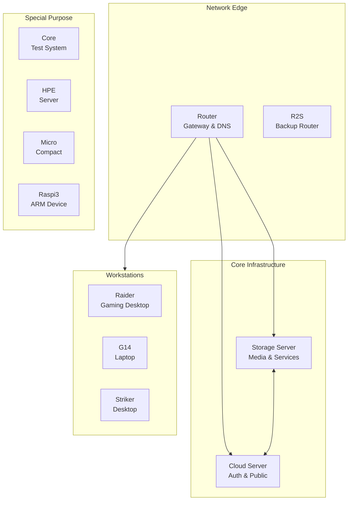

# Hosts Overview

## Infrastructure Topology

This infrastructure consists of multiple specialized hosts, each serving specific purposes in the overall architecture.



## Host Categories

### 🖥️ Infrastructure Servers

| Host | Role | Architecture | Key Services |
|------|------|--------------|--------------|
| **[Storage](storage.md)** | Primary server | x86_64 | Media, files, databases |
| **[Cloud](cloud.md)** | Public services | x86_64 | Auth, websites, APIs |

### 🌐 Network Devices

| Host | Role | Architecture | Key Services |
|------|------|--------------|--------------|
| **[Router](router.md)** | Main gateway | x86_64 | Firewall, DNS, VPN |
| **[R2S](r2s.md)** | Backup router | aarch64 | Failover networking |

### 💻 Workstations

| Host | Role | Architecture | Features |
|------|------|--------------|----------|
| **[Raider](desktop.md#raider)** | Gaming desktop | x86_64 | NVIDIA GPU, Steam |
| **[G14](desktop.md#g14)** | Laptop | x86_64 | Portable development |
| **[Striker](desktop.md#striker)** | Desktop | x86_64 | General purpose |

### 🔧 Special Purpose

| Host | Role | Architecture | Purpose |
|------|------|--------------|---------|
| **[Core](embedded.md#core)** | Test system | x86_64 | Development testing |
| **[HPE](embedded.md#hpe)** | Server | x86_64 | Experimental |
| **[Micro](embedded.md#micro)** | Compact PC | x86_64 | Low-power services |
| **[Raspi3](embedded.md#raspi3)** | Raspberry Pi | aarch64 | IoT projects |

## Common Configuration

All hosts share certain base configurations through the constellation common module:

### Standard Features
- **Nix Flakes**: Reproducible system configuration
- **Tailscale**: Secure mesh VPN connectivity
- **SSH**: Hardened remote access
- **Monitoring**: Netdata agent for metrics
- **Backups**: Automated backup integration

### Security Baseline
- Firewall enabled with minimal exposed ports
- SSH key-only authentication
- Automatic security updates
- Encrypted secrets with agenix

## Host Naming Convention

Hosts follow a consistent naming pattern:
- **Infrastructure**: Functional names (storage, cloud, router)
- **Workstations**: Model or codenames (raider, g14, striker)
- **Embedded**: Device type (raspi3, r2s)

## Network Addressing

### Tailscale Network
All hosts are accessible via Tailscale:
```
hostname.bat-boa.ts.net
```

### Local Network
Internal LAN addresses:
```
192.168.1.x
```

## Deployment Status

| Host | Status | Auto-Deploy | Monitoring |
|------|--------|-------------|------------|
| Storage | ✅ Production | Yes | Full |
| Cloud | ✅ Production | Yes | Full |
| Router | ✅ Production | Yes | Basic |
| R2S | ⚠️ Standby | No | Basic |
| Raider | ✅ Active | No | Basic |
| G14 | ✅ Active | No | Basic |
| Others | 🔄 Various | No | None |

## Resource Allocation

### Storage Distribution
```
Storage Server: 80% of total storage
Cloud Server: 15% of total storage
Other Hosts: 5% of total storage
```

### Service Distribution
```
Storage: 70% of services
Cloud: 20% of services
Router: 5% of services
Others: 5% of services
```

## High Availability

### Redundancy Strategy
1. **Network**: Router + R2S for failover
2. **Services**: Critical services on multiple hosts
3. **Storage**: RAID arrays with backup
4. **Power**: UPS protection for servers

### Failover Procedures
- Automatic failover for network services
- Manual failover for stateful services
- Backup restoration procedures documented

## Management

### Remote Access
All hosts accessible via:
1. Tailscale SSH
2. Direct SSH (LAN only)
3. Web interfaces for services

### Update Strategy
- **Servers**: Weekly updates with testing
- **Workstations**: User-initiated updates
- **Network**: Quarterly maintenance windows

### Monitoring
- Real-time metrics via Netdata
- Service health via Homepage
- Alerts via email and Ntfy