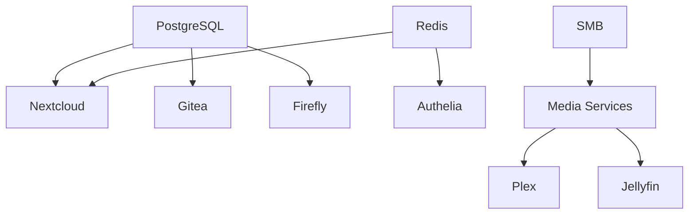

# Storage Server

## Overview

The storage server is the primary workhorse of the infrastructure, hosting most services including media streaming, file storage, development tools, and monitoring systems.

## Hardware Specifications

### System Overview
- **Motherboard**: Intel 13th Gen Raptor Lake B760-M D5
- **CPU**: Intel Core i5-13400 (6P+4E cores, 16 threads @ 4.5GHz)
- **RAM**: 32GB DDR5 (2x16GB) @ 4800/5600MHz mixed
- **GPU**: Intel UHD Graphics 730 (integrated)
- **Network**: Realtek RTL8125 2.5GbE
- **Storage Controller**: LSI SAS HBA (mpt3sas)
- **Power**: Standard ATX PSU

### Detailed Specifications

#### Processor
- **Model**: Intel Core i5-13400 (Raptor Lake)
- **Architecture**: 6 Performance + 4 Efficiency cores
- **Threads**: 16 total
- **Base Clock**: 2.5GHz (E-cores) / 2.5GHz (P-cores)
- **Boost Clock**: 4.6GHz (P-cores)
- **Cache**: 
  - L1: 448KB (192KB data + 128KB instruction + 256KB E-core)
  - L2: 9MB (5MB P-cores + 4MB E-cores)
  - L3: 24MB shared
- **Features**: Intel Quick Sync, AES-NI, VT-x, VT-d

#### Memory
- **Slot 0**: 16GB DDR5-4800 (Patriot PSD516G480081)
- **Slot 1**: 16GB DDR5-5600 (Patriot 5600 Series)
- **Configuration**: Dual-channel, mixed speeds (runs at 4800MHz)
- **Total**: 32GB ECC-capable (but not ECC memory)

#### Storage
- **Boot Drive**: Intel 660p 512GB NVMe (SSDPEKNW512G8)
  - M.2 2280 form factor
  - PCIe 3.0 x4
  - ~3.5GB/s read, ~1.6GB/s write
- **Cache Drive**: XrayDisk 512GB NVMe
  - M.2 2280 form factor
  - Used for fast cache and VM storage
- **HDD Array**: Via LSI SAS HBA
  - Supports up to 8 SATA/SAS drives
  - Currently configured with bcachefs redundancy

#### Networking
- **Primary**: Realtek RTL8125BG 2.5GbE
  - Full 2.5Gbps link established
  - Jumbo frames support
  - Wake-on-LAN capable
- **Speed**: 2.5GbE throughout home network

## System Configuration

### Base System
```nix
{
  system.stateVersion = "23.11";
  networking.hostName = "storage";
  time.timeZone = "America/New_York";
}
```

### Storage Layout

```
/                      # Btrfs on Intel 660p NVMe (512GB)
├── /boot             # EFI System Partition (500MB FAT16)
├── /nix              # Nix store (Btrfs subvolume)
├── /var/lib          # Service data (Btrfs subvolume)
└── /home             # User homes (Btrfs subvolume)

/mnt/
├── data/              # Bcachefs array - main data storage
│   ├── media/        # Media library
│   │   ├── movies/   # Movie collection
│   │   ├── tv/       # TV shows
│   │   ├── music/    # Music library
│   │   └── books/    # eBooks/audiobooks
│   ├── files/        # Service persistent data
│   │   ├── plex/     # Plex configuration
│   │   ├── jellyfin/ # Jellyfin configuration
│   │   ├── nextcloud/# Nextcloud data
│   │   └── ...
│   └── backup/       # Local backup storage
└── storage/          # Bind mount to /mnt/data (historical)
```

### Filesystem Configuration
- **Boot/System**: Btrfs with zstd:3 compression, snapshots
- **Bulk Storage**: Bcachefs for data integrity and performance
- **Bind Mount**: `/mnt/storage` → `/mnt/data` for backwards compatibility

### Enabled Modules

```nix
constellation = {
  common.enable = true;        # Base configuration
  services.enable = true;      # Service registry
  backup.enable = true;        # Automated backups
  media.enable = true;         # Media services
  podman.enable = true;        # Container runtime
  netdata.enable = true;       # Monitoring
  users.enable = true;         # User management
};
```

## Services Hosted

### Media Services

#### Streaming Servers
- **Plex**: Primary media server with hardware transcoding
- **Jellyfin**: Open-source alternative
- **Navidrome**: Music streaming with subsonic API

#### Content Management
Complete *arr stack for automated media management:
- **Sonarr**: TV show automation
- **Radarr**: Movie automation
- **Lidarr**: Music automation
- **Readarr**: Book/audiobook automation
- **Bazarr**: Subtitle automation

#### Download Infrastructure
- **SABnzbd**: Usenet downloads
- **qBittorrent**: BitTorrent with VPN
- **Transmission**: Additional BitTorrent client

### Storage Services

#### Cloud Storage
- **Nextcloud**: Full-featured cloud platform
- **Seafile**: Fast file synchronization
- **Syncthing**: P2P file sync

#### File Management
- **FileBrowser**: Web-based file manager
- **Samba**: Windows file sharing
- **Time Machine**: macOS backup server

### Development Infrastructure

#### Source Control
- **Gitea**: Self-hosted Git service
- **Act Runner**: CI/CD runner

#### Development Tools
- **Code-server**: Browser-based VS Code
- **n8n**: Workflow automation
- **Kestra**: Data pipeline orchestration

### Monitoring & Management

#### System Monitoring
- **Netdata**: Real-time system metrics
- **Grafana**: Metric visualization
- **Prometheus**: Time-series database
- **Loki**: Log aggregation

#### Service Monitoring
- **Homepage**: Service dashboard
- **Beszel**: Uptime monitoring
- **Scrutiny**: S.M.A.R.T. disk monitoring

### Database Services

Shared databases for applications:
- **PostgreSQL**: Primary database
- **MySQL/MariaDB**: Legacy applications
- **Redis**: Cache and sessions
- **InfluxDB**: Time-series data

## Network Configuration

### Interfaces
- **Primary**: 10Gb Ethernet for LAN
- **Tailscale**: VPN interface for secure access
- **Bridge**: Container networking

### Firewall Rules
```nix
networking.firewall = {
  allowedTCPPorts = [
    80 443     # HTTP/HTTPS
    445        # SMB
    # ... service-specific ports
  ];
};
```

### Container Networking
All services run in Podman containers with:
- Isolated networks per service group
- Port forwarding for external access
- Internal DNS resolution

## Backup Configuration

### Backup Schedule
Weekly automated backups via Rustic:
```nix
services.rustic.backups = {
  storage = {
    paths = [
      "/mnt/data"
      "/etc"
      "/home"
    ];
    exclude = [
      "*/cache/*"
      "*/tmp/*"
      "*.tmp"
    ];
  };
};
```

### Backup Destinations
1. **Local**: Fast recovery backup on separate disk
2. **Cottage S3**: Primary off-site backup
3. **IDrive**: Cloud backup for critical data

## Performance Optimization

### Hardware Acceleration
- **Intel Quick Sync**: Hardware video encoding/decoding
  - H.264, H.265/HEVC, VP9, AV1 decode
  - Used by Plex/Jellyfin for transcoding
  - Minimal CPU usage during transcoding
- **CPU Features**: 
  - AVX2 for optimized workloads
  - AES-NI for encryption acceleration
  - P-cores handle intensive tasks
  - E-cores handle background services

### Storage Optimization
- **Bcachefs**: Modern CoW filesystem with built-in compression and checksums
- **SSD Cache**: NVMe drives for system and frequently accessed data
- **Data Integrity**: Bcachefs provides checksumming and self-healing

### Service Optimization
- **Container limits**: Resource constraints per service
- **Database tuning**: Optimized for workload
- **Caching**: Redis for application performance

## Maintenance Tasks

### Regular Maintenance
1. **Daily**: Container image updates
2. **Weekly**: Backup verification
3. **Monthly**: Disk health checks
4. **Quarterly**: Full system updates

### Monitoring Alerts
- Disk space warnings at 80%
- Service failures trigger notifications
- Backup failures send email alerts
- Temperature monitoring for hardware

## Troubleshooting

### Common Issues

#### Service Won't Start
```bash
# Check container status
podman ps -a

# View container logs
podman logs <container-name>

# Check systemd service
systemctl status podman-<service>
```

#### Storage Issues
```bash
# Check disk usage
df -h

# Bcachefs filesystem status
bcachefs fs show

# SMART status
smartctl -a /dev/sdX

# Check smartd service status
systemctl status smartd

# View smartd logs
journalctl -u smartd -f
```

### SMART Monitoring Configuration

The storage host uses smartd to monitor all drives for health issues:

#### Monitored Devices
- `/dev/sda`, `/dev/sdb`, `/dev/sdc`, `/dev/sdf` - Standard monitoring
- `/dev/sdd`, `/dev/sde` - **Enhanced monitoring** with Raw_Read_Error_Rate alerts
- `/dev/nvme0n1` - Standard monitoring

#### Email Alerts
Email notifications are sent for:
- SMART health status failures
- Self-test failures
- Pre-failure attributes reaching thresholds
- **For /dev/sdd and /dev/sde**: Any change in Raw_Read_Error_Rate (attribute 1)

The enhanced monitoring on `/dev/sdd` and `/dev/sde` was added due to progressive increases in Raw_Read_Error_Rate, which indicates potential disk degradation. Any further changes will trigger immediate email alerts.

#### Configuration
Located in `/hosts/storage/configuration.nix`:
```nix
services.smartd = {
  enable = true;
  notifications.mail.enable = true;
  notifications.test = true;
  devices = [ /* explicit device list */ ];
};
```

#### Performance Problems
```bash
# Check system resources
htop

# Container resource usage
podman stats

# Network performance
iperf3 -s  # On storage
iperf3 -c storage.bat-boa.ts.net  # From client
```

## Integration Points

### Service Dependencies


### External Connections
- **Cloud Server**: Authentication services
- **Router**: DNS resolution
- **Clients**: Media streaming, file access

## Security Considerations

### Access Control
- All services behind Authelia authentication
- API keys for service-to-service communication
- Firewall restricts unnecessary ports

### Data Protection
- Encrypted backups
- Bcachefs snapshots for quick recovery
- Bcachefs redundancy for hardware failure protection

### Container Security
- Rootless Podman containers
- Read-only root filesystems where possible
- Regular security updates