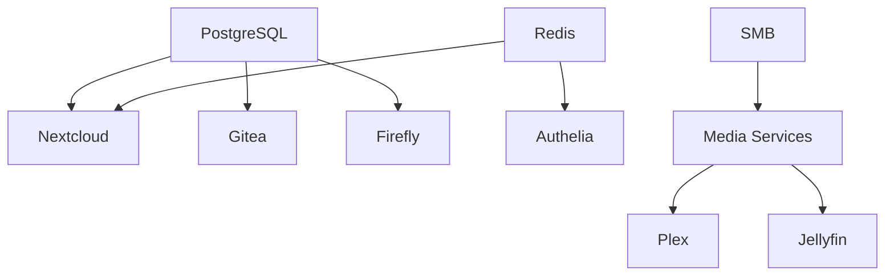

# Storage Server

## Overview

The storage server is the primary workhorse of the infrastructure, hosting most services including media streaming, file storage, development tools, and monitoring systems.

## Hardware Specifications

The storage server is a custom-built system optimized for:
- High-capacity storage with RAID arrays
- GPU acceleration for media transcoding
- Sufficient RAM for multiple services
- 10Gb networking for fast data access

## System Configuration

### Base System
```nix
{
  system.stateVersion = "23.11";
  networking.hostName = "storage";
  time.timeZone = "America/New_York";
}
```

### Storage Layout

```
/mnt/
├── data/              # Service persistent data
│   ├── plex/         # Plex configuration
│   ├── jellyfin/     # Jellyfin configuration
│   ├── nextcloud/    # Nextcloud data
│   └── ...
├── media/             # Media library
│   ├── movies/       # Movie collection
│   ├── tv/           # TV shows
│   ├── music/        # Music library
│   └── books/        # eBooks/audiobooks
├── backups/           # Local backup storage
└── tank/              # ZFS pool (if applicable)
```

### Enabled Modules

```nix
constellation = {
  common.enable = true;        # Base configuration
  services.enable = true;      # Service registry
  backup.enable = true;        # Automated backups
  media.enable = true;         # Media services
  podman.enable = true;        # Container runtime
  netdata.enable = true;       # Monitoring
  users.enable = true;         # User management
};
```

## Services Hosted

### Media Services

#### Streaming Servers
- **Plex**: Primary media server with hardware transcoding
- **Jellyfin**: Open-source alternative
- **Navidrome**: Music streaming with subsonic API

#### Content Management
Complete *arr stack for automated media management:
- **Sonarr**: TV show automation
- **Radarr**: Movie automation
- **Lidarr**: Music automation
- **Readarr**: Book/audiobook automation
- **Bazarr**: Subtitle automation

#### Download Infrastructure
- **SABnzbd**: Usenet downloads
- **qBittorrent**: BitTorrent with VPN
- **Transmission**: Additional BitTorrent client

### Storage Services

#### Cloud Storage
- **Nextcloud**: Full-featured cloud platform
- **Seafile**: Fast file synchronization
- **Syncthing**: P2P file sync

#### File Management
- **FileBrowser**: Web-based file manager
- **Samba**: Windows file sharing
- **Time Machine**: macOS backup server

### Development Infrastructure

#### Source Control
- **Gitea**: Self-hosted Git service
- **Act Runner**: CI/CD runner

#### Development Tools
- **Code-server**: Browser-based VS Code
- **n8n**: Workflow automation
- **Kestra**: Data pipeline orchestration

### Monitoring & Management

#### System Monitoring
- **Netdata**: Real-time system metrics
- **Grafana**: Metric visualization
- **Prometheus**: Time-series database
- **Loki**: Log aggregation

#### Service Monitoring
- **Homepage**: Service dashboard
- **Beszel**: Uptime monitoring
- **Scrutiny**: S.M.A.R.T. disk monitoring

### Database Services

Shared databases for applications:
- **PostgreSQL**: Primary database
- **MySQL/MariaDB**: Legacy applications
- **Redis**: Cache and sessions
- **InfluxDB**: Time-series data

## Network Configuration

### Interfaces
- **Primary**: 10Gb Ethernet for LAN
- **Tailscale**: VPN interface for secure access
- **Bridge**: Container networking

### Firewall Rules
```nix
networking.firewall = {
  allowedTCPPorts = [
    80 443     # HTTP/HTTPS
    445        # SMB
    # ... service-specific ports
  ];
};
```

### Container Networking
All services run in Podman containers with:
- Isolated networks per service group
- Port forwarding for external access
- Internal DNS resolution

## Backup Configuration

### Backup Schedule
Weekly automated backups via Rustic:
```nix
services.rustic.backups = {
  storage = {
    paths = [
      "/mnt/data"
      "/etc"
      "/home"
    ];
    exclude = [
      "*/cache/*"
      "*/tmp/*"
      "*.tmp"
    ];
  };
};
```

### Backup Destinations
1. **Local**: Fast recovery backup on separate disk
2. **Cottage S3**: Primary off-site backup
3. **IDrive**: Cloud backup for critical data

## Performance Optimization

### Hardware Acceleration
- **GPU**: Used for Plex/Jellyfin transcoding
- **Quick Sync**: Intel hardware encoding
- **NVENC**: NVIDIA encoding (if available)

### Storage Optimization
- **ZFS**: Advanced filesystem with snapshots
- **SSD Cache**: Fast access to frequently used data
- **RAID**: Redundancy for data protection

### Service Optimization
- **Container limits**: Resource constraints per service
- **Database tuning**: Optimized for workload
- **Caching**: Redis for application performance

## Maintenance Tasks

### Regular Maintenance
1. **Daily**: Container image updates
2. **Weekly**: Backup verification
3. **Monthly**: Disk health checks
4. **Quarterly**: Full system updates

### Monitoring Alerts
- Disk space warnings at 80%
- Service failures trigger notifications
- Backup failures send email alerts
- Temperature monitoring for hardware

## Troubleshooting

### Common Issues

#### Service Won't Start
```bash
# Check container status
podman ps -a

# View container logs
podman logs <container-name>

# Check systemd service
systemctl status podman-<service>
```

#### Storage Issues
```bash
# Check disk usage
df -h

# ZFS pool status
zpool status

# SMART status
smartctl -a /dev/sdX
```

#### Performance Problems
```bash
# Check system resources
htop

# Container resource usage
podman stats

# Network performance
iperf3 -s  # On storage
iperf3 -c storage.bat-boa.ts.net  # From client
```

## Integration Points

### Service Dependencies


### External Connections
- **Cloud Server**: Authentication services
- **Router**: DNS resolution
- **Clients**: Media streaming, file access

## Security Considerations

### Access Control
- All services behind Authelia authentication
- API keys for service-to-service communication
- Firewall restricts unnecessary ports

### Data Protection
- Encrypted backups
- ZFS snapshots for quick recovery
- RAID for hardware failure protection

### Container Security
- Rootless Podman containers
- Read-only root filesystems where possible
- Regular security updates