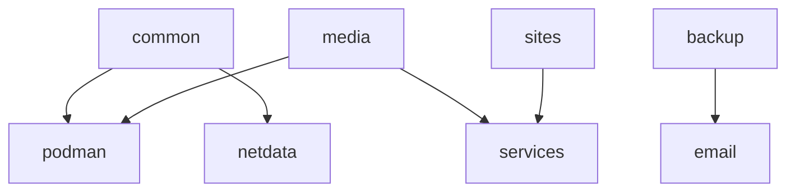

# Constellation Modules

## Overview

The constellation module system provides a flexible way to share configuration across hosts. These modules define optional features that can be enabled on any system, promoting code reuse and consistency.

## Module Structure

```
modules/constellation/
├── backup.nix          # Backup system configuration
├── common.nix          # Base configuration for all hosts
├── email.nix           # Email notifications
├── media.nix           # Media service definitions
├── netdata-client.nix  # Monitoring agent
├── podman.nix          # Container runtime
├── services.nix        # Service registry
├── users.nix           # User management
└── sites/              # Website configurations
    ├── arsfeld-dev.nix
    ├── rosenfeld-blog.nix
    └── rosenfeld-one.nix
```

## Core Modules

### `common.nix` - Base Configuration

Applied to all constellation hosts, providing:

```nix
constellation.common.enable = true;
```

**Features:**
- Nix configuration (flakes, garbage collection)
- Essential packages (git, vim, htop, etc.)
- Tailscale VPN setup
- mDNS/Avahi for local discovery
- SSH hardening
- Firewall configuration
- Timezone and locale settings

**Key Configurations:**
```nix
# Automatic garbage collection
nix.gc = {
  automatic = true;
  dates = "weekly";
  options = "--delete-older-than 30d";
};

# Tailscale integration
services.tailscale.enable = true;
services.tailscale.extraUpFlags = ["--ssh"];
```

### `services.nix` - Service Registry

Central registry of all services in the infrastructure:

```nix
constellation.services = {
  plex = {
    host = "storage";      # Which host runs this service
    port = 32400;          # Service port
    public = true;         # Internet accessible
    bypassAuth = false;    # Requires authentication
    tailscaleFunnel = false; # Expose via Tailscale
  };
};
```

**Service Properties:**
- `host`: Target host system
- `port`: Network port
- `public`: Internet exposure
- `bypassAuth`: Skip Authelia authentication
- `tailscaleFunnel`: Tailscale Funnel exposure

**Generated Outputs:**
- Caddy reverse proxy configuration
- DNS entries
- Firewall rules
- Service discovery information

### `backup.nix` - Backup Configuration

Automated backup system using Rustic:

```nix
constellation.backup = {
  enable = true;
  paths = [
    "/home"
    "/etc"
    "/var/lib"
  ];
  exclude = [
    "*.tmp"
    "cache/"
  ];
};
```

**Features:**
- Weekly scheduled backups
- Multiple destinations (S3, rclone)
- Encryption and deduplication
- Pre/post backup hooks
- Email notifications

**Backup Destinations:**
1. **Cottage S3**: Primary backup location
2. **IDrive**: Cloud backup via rclone
3. **Local**: Optional local copies

### `email.nix` - Email Notifications

System email notifications via msmtp:

```nix
constellation.email = {
  enable = true;
  recipient = "admin@example.com";
};
```

**Notification Types:**
- System boot/shutdown
- Weekly health reports
- Backup completion
- Service failures

### `media.nix` - Media Stack

Defines the complete media service ecosystem:

```nix
constellation.media = {
  enable = true;
  host = "storage";
};
```

**Service Categories:**

#### Streaming Services
- **Plex**: Primary media server
- **Jellyfin**: Open-source alternative
- **Navidrome**: Music streaming
- **Stash**: Adult content management

#### Content Management
- **Sonarr**: TV show management
- **Radarr**: Movie management
- **Lidarr**: Music management
- **Readarr**: Book management

#### Download Clients
- **SABnzbd**: Usenet downloader
- **qBittorrent**: BitTorrent client
- **Transmission**: Lightweight BitTorrent

#### Support Services
- **Prowlarr**: Indexer management
- **Bazarr**: Subtitle management
- **Tdarr**: Media transcoding
- **Plex-Meta-Manager**: Metadata management

### `podman.nix` - Container Runtime

Container configuration for services:

```nix
constellation.podman = {
  enable = true;
  enableDocker = true;
  autoUpdate = true;
};
```

**Features:**
- Rootless containers
- Docker compatibility
- Automatic updates
- Registry mirroring
- Resource limits

### `netdata-client.nix` - Monitoring

Distributed monitoring with Netdata:

```nix
constellation.netdata = {
  enable = true;
  parent = "storage.bat-boa.ts.net";
};
```

**Metrics Collected:**
- System resources (CPU, RAM, disk)
- Network traffic
- Container statistics
- Service health
- Custom applications

### `users.nix` - User Management

Consistent user configuration across hosts:

```nix
constellation.users = {
  enable = true;
  users = {
    arsfeld = {
      isAdmin = true;
      sshKeys = [ "ssh-ed25519 ..." ];
    };
  };
};
```

## Site Modules

### Website Configurations

Each site module defines a complete web application:

```nix
# sites/arsfeld-dev.nix
constellation.sites.arsfeld-dev = {
  enable = true;
  host = "cloud";
  domain = "arsfeld.dev";
  service = "ghost";
};
```

**Common Patterns:**
- Caddy configuration
- SSL certificates
- Database setup
- Container deployment

## Module Integration

### Enabling Modules

In host configuration:
```nix
# hosts/storage/configuration.nix
{
  constellation = {
    common.enable = true;
    backup.enable = true;
    services.enable = true;
    media.enable = true;
    podman.enable = true;
    netdata.enable = true;
  };
}
```

### Module Dependencies

Some modules depend on others:


### Configuration Precedence

1. Module defaults
2. Module options
3. Host-specific overrides
4. Runtime configuration

## Best Practices

### Creating New Modules

1. **Single Responsibility**: Each module should have one clear purpose
2. **Optional Features**: Use enable flags for all features
3. **Sensible Defaults**: Provide good defaults for all options
4. **Documentation**: Include comments explaining options

### Module Template

```nix
{ config, lib, pkgs, ... }:
with lib;
let
  cfg = config.constellation.mymodule;
in {
  options.constellation.mymodule = {
    enable = mkEnableOption "My module description";
    
    option1 = mkOption {
      type = types.str;
      default = "default-value";
      description = "Description of option1";
    };
  };
  
  config = mkIf cfg.enable {
    # Module implementation
  };
}
```

### Testing Modules

1. Test on single host first
2. Verify no conflicts with existing modules
3. Check resource usage
4. Validate backup coverage

## Advanced Features

### Dynamic Service Discovery

Services can discover each other:
```nix
# Get all services on a host
config.constellation.services.byHost."storage"

# Get service details
config.constellation.services.all.plex.port
```

### Cross-Host Configuration

Modules can configure multiple hosts:
```nix
# In media.nix
config = mkIf cfg.enable {
  # Configure media host
  networking.firewall.allowedTCPPorts = [ ... ];
  
  # Configure gateway host
  services.caddy.virtualHosts = { ... };
};
```

### Secret Integration

Modules integrate with agenix:
```nix
age.secrets.mySecret = {
  file = ../../secrets/mySecret.age;
  owner = "service-user";
};
```