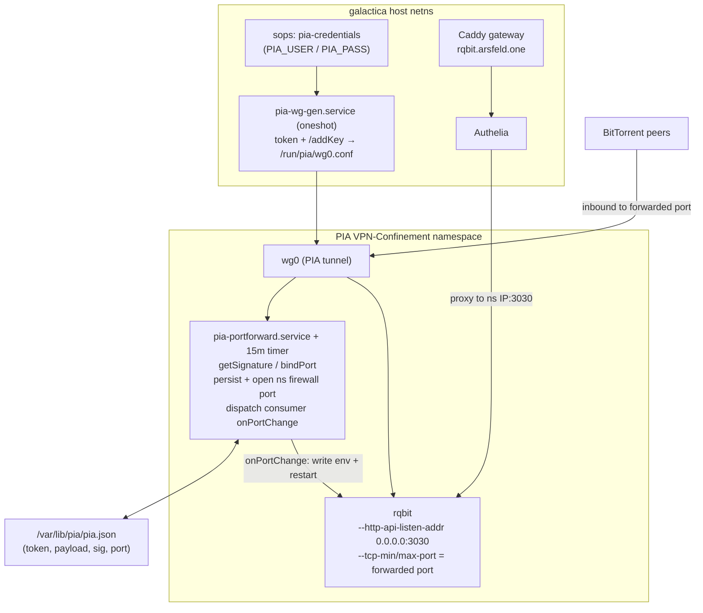

# feat: PIA VPN module with dynamic port forwarding (rqbit first consumer)

## Summary

Build a reusable `constellation.pia` NixOS module that runs Private Internet Access
(PIA) in its own VPN-Confinement WireGuard namespace, performs PIA's dynamic
API-driven port forwarding, and exposes an **extensible consumer seam** so any
torrent client or app can attach: declare a consumer, get the forwarded port handed
to it, and react to port changes. rqbit is the first consumer — VPN-confined,
behind Authelia at `rqbit.arsfeld.one`, with a working inbound peer port. The PIA
namespace runs **alongside** the existing AirVPN namespace; qBittorrent and
Transmission are untouched (migration deferred).

This plan supersedes the original rqbit brainstorm scope (a bare standalone rqbit) —
the brainstorm's intent (try-out rqbit, VPN-confined, Authelia-fronted, not wired to
the *arr stack) is preserved as the rqbit consumer unit, but the work now centers on
the PIA module that makes a real inbound port forward possible.

---

## Problem Frame

The user opened a PIA account specifically for its API-based port forwarding. The
existing torrent stack runs on AirVPN inside a VPN-Confinement namespace
(`hosts/galactica/services/qbittorrent-vpn.nix`, `transmission-vpn.nix`), where the
`wg-up` script is `lib.mkForce`'d to hardcode DNAT/INPUT rules for the two web UIs
and **never opens an inbound peer port on the tunnel interface** — so inbound peering
is effectively broken there today (Transmission's `peer-port = 30158` receives
nothing). The goal is not to patch that, but to stand up PIA correctly with a real,
maintained inbound port, and to do it as a module future apps can reuse rather than a
one-off.

PIA port forwarding is **dynamic and lease-based**, unlike AirVPN's static reserved
port. The mechanics (verified against `pia-foss/manual-connections`, 2026):

1. Authenticate (username/password) → token (~24h validity).
2. Generate an ephemeral WireGuard keypair, register the pubkey via the PIA server's
   `/addKey` endpoint (port 1337) → receive server pubkey, peer VIP, DNS, endpoint.
   This *is* the WireGuard config — it is generated per session, not a static file.
3. Over the live tunnel, `GET <pf-hostname>:19999/getSignature?token=…` → a
   `payload` (base64: `{token, port, expires_at}`) + `signature`. The **port is
   assigned by PIA**, not chosen. The payload is valid **~60 days**.
4. `GET <pf-hostname>:19999/bindPort?payload=…&signature=…` must be re-called every
   **≤15 minutes** or the binding drops.

`jdelkins/pia-tools` was evaluated as a wrapper (see origin discussion) and rejected:
it owns its WireGuard tunnel at the **host** level via systemd-networkd with a
full-tunnel default route, cannot run inside an existing namespace, and has no
generic port-change hook (only hardcoded Transmission/rTorrent RPC). Both the
namespace confinement and the extensible per-app hook — the actual requirements —
would have to be built around it anyway. Porting `manual-connections`' ~200 lines of
PF protocol into a daemon we control is the cleaner fit.

---

## Key Technical Decisions

- **Hand-rolled PF daemon inside a VPN-Confinement namespace, not pia-tools.**
  pia-tools is host-level + systemd-networkd + no namespace support + no generic
  hook (see Problem Frame). A custom daemon porting `manual-connections`
  `get_token` / `connect_to_wireguard_with_token` / `port_forwarding` gives us
  clean namespace confinement, full control of the consumer hook, and consistency
  with the existing AirVPN torrent pattern. (see origin: docs/brainstorms/2026-05-30-rqbit-galactica-requirements.md)

- **PIA runs as a second namespace alongside AirVPN; rqbit-only consumer for now.**
  The existing `wg` (AirVPN) namespace and its clients are untouched. The PIA
  namespace is independent. The module is designed so qBittorrent/Transmission
  *could* migrate later, but that migration is deferred (Scope Boundaries).

- **The WireGuard config is generated at runtime, not stored statically.** PIA's
  tunnel parameters come from the `/addKey` flow with an ephemeral keypair. A oneshot
  unit runs the token+addKey flow and writes a wg-quick-format config to a runtime
  path (e.g. `/run/pia/wg0.conf`) **before** the namespace tunnel comes up. Only the
  PIA username/password live in sops. This is a departure from the AirVPN setup,
  where `wireguardConfigFile` points at a static sops secret.

- **The forwarded port is opened in the namespace firewall at runtime, by the
  daemon.** Because the assigned port is dynamic, it cannot be declared in
  VPN-Confinement's build-time `openVPNPorts`. The PF daemon adds an `iptables`
  ACCEPT rule on the tunnel interface for the current port (and removes the previous
  one) whenever the port is acquired or changes.

- **Extensibility seam = `constellation.pia.consumers.<name>`.** Each consumer
  declares an `onPortChange` command (and optional web-UI `port`/`host` metadata).
  The daemon persists the port and, on first acquisition and on any change, runs each
  consumer's `onPortChange` with the port in the environment. This is the abstraction
  pia-tools lacks and the heart of the request — each app handles the port its own
  way (API call, RPC, or restart).

- **rqbit consumes the port by restarting.** rqbit (v8.1.1 in nixpkgs) has no runtime
  port API; the listen port is fixed at startup via `--tcp-min-port`/`--tcp-max-port`.
  rqbit's `onPortChange` writes the port to an env file and runs
  `systemctl restart rqbit`. rqbit's `ExecStartPre` reads the cached port so a reboot
  comes up on the right port. Because the payload is valid ~60 days and the port is
  stable across keepalives and reboots (persisted cache), restarts are rare.

- **rqbit web UI is fronted by Authelia (no `bypassAuth`).** rqbit has no built-in
  auth; unlike qBittorrent/Transmission (which set `bypassAuth = true`), the
  `rqbit.arsfeld.one` vhost requires Authelia so the public hostname isn't an open
  torrent controller. (origin R4)

- **Port persistence cache lives at `/var/lib/pia/<ns>.json`.** Stores token,
  payload, signature, `expires_at`, and assigned port so the port survives reboots
  and the daemon rebinds without re-requesting a signature until expiry.

---

## High-Level Technical Design

Directional architecture — the prose and per-unit fields are authoritative where they
disagree.



Two lifecycles:
- **Connect/refresh:** sops creds → `pia-wg-gen` builds the tunnel config → namespace
  tunnel up → `pia-portforward` acquires signature+port, persists, opens the port in
  the namespace firewall, dispatches `onPortChange` → timer rebinds every 15 min.
- **Data:** inbound peers hit the forwarded port on `wg0` → rqbit; web UI traffic
  hits Caddy → Authelia → rqbit at the namespace IP.

---

## Output Structure

New and modified files (repo-relative):

```
modules/constellation/
  pia.nix                         # NEW: the extensible PIA module (options + namespace + daemon + timer)
packages/
  pia-portforward.nix             # NEW (optional): the PF daemon script as a packaged derivation
hosts/galactica/
  services/rqbit.nix              # NEW: rqbit service, first PIA consumer
  services/default.nix            # MODIFIED: import rqbit.nix
  configuration.nix               # MODIFIED: enable constellation.pia + rqbit
secrets/sops/galactica.yaml       # MODIFIED: add pia-credentials env secret
```

The PF daemon may be inlined in `pia.nix` via `pkgs.writeShellApplication` rather than
a separate `packages/` file — the implementer picks based on size. The per-unit Files
lists are authoritative.

---

## Implementation Units

### U1. PIA credentials secret

**Goal:** Make PIA username/password available to the namespace services as an
EnvironmentFile, via sops.

**Requirements:** Supports U3, U4 (origin: dependency/assumption — external account).

**Dependencies:** none.

**Files:**
- `secrets/sops/galactica.yaml` (add `pia-credentials`)
- `.sops.yaml` (only if a new creation rule is needed — likely already covers galactica)

**Approach:** Add a sops secret `pia-credentials` rendered as an env file containing
`PIA_USER=…` and `PIA_PASS=…`. Declare it in the PIA module (U2) via
`sops.secrets."pia-credentials"` with mode `0400` and owner of the namespace service
user. Editing is automated per repo convention (`sops secrets/sops/galactica.yaml`).

**Patterns to follow:** `sops.secrets."airvpn-wireguard"` in
`hosts/galactica/services/qbittorrent-vpn.nix:31`; sops module
`modules/constellation/sops.nix`.

**Test scenarios:** Test expectation: none — secret material, verified at runtime in
U6 (service reads creds and authenticates successfully).

**Verification:** `sops --decrypt secrets/sops/galactica.yaml` shows the keys;
galactica builds with the secret declared.

---

### U2. `constellation.pia` module skeleton, options, and namespace

**Goal:** Define the reusable module: its option surface (including the consumer
seam) and the PIA VPN-Confinement namespace it manages.

**Requirements:** Origin R1 (VPN-confined), R3 routing prerequisites; establishes the
extensibility contract that is the core of this plan.

**Dependencies:** U1.

**Files:**
- `modules/constellation/pia.nix` (NEW)

**Approach:** Auto-loaded by haumea (no explicit import). Expose under
`constellation.pia`:
- `enable`
- `credentialsFile` (default `config.sops.secrets."pia-credentials".path`)
- `region` (PIA region id or `"auto"`; used by the gen/PF flow to pick a
  port-forward-capable server — note all US regions lack PF)
- `namespace` (default `"pia"`), `namespaceAddress` (a distinct subnet from AirVPN's
  `192.168.15.0/24`, e.g. `192.168.16.0/24`)
- `consumers` = attrsOf submodule `{ onPortChange = lines/str (command run with
  $PIA_FORWARDED_PORT in env); port = nullOr port; host = str (namespace IP for the
  gateway); }`
- read-only `portFile` path others can read.

Configure a VPN-Confinement `vpnNamespaces.<namespace>` using the runtime-generated
config from U3 (`wireguardConfigFile = "/run/pia/wg0.conf"`), `accessibleFrom` the
Tailscale/LAN/podman ranges (mirror qbittorrent-vpn.nix:39-43), and `portMappings`
for each consumer's web `port`. Do **not** `mkForce` the `wg-up` script — PIA
endpoints don't need the AirVPN ping-check hack, so the module's native script (and
its `portMappings` handling) can be used as-is.

**Patterns to follow:** `vpnNamespaces.wg` block in
`hosts/galactica/services/qbittorrent-vpn.nix:34-59`; constellation module option
style in `modules/constellation/*.nix`; VPN-Confinement option schema
(`openVPNPorts`/`portMappings` submodules).

**Technical design (directional):**
```nix
options.constellation.pia = {
  enable = mkEnableOption "PIA VPN namespace with dynamic port forwarding";
  consumers = mkOption {
    type = attrsOf (submodule { options = {
      onPortChange = mkOption { type = lines; };   # runs with $PIA_FORWARDED_PORT
      port = mkOption { type = nullOr port; default = null; };  # web UI port → portMapping
      host = mkOption { type = str; };             # namespace IP for gateway proxy
    };});
    default = {};
  };
};
```

**Test scenarios:**
- Module with `enable = false` is a no-op (no namespace, no services).
- `nix build .#nixosConfigurations.galactica…toplevel` evaluates with
  `constellation.pia.enable = true` and one consumer declared.
- A consumer with `port = null` produces no `portMappings` entry; with a port set,
  exactly one mapping appears.

**Verification:** galactica config evaluates; `ip netns list` shows the `pia`
namespace after activation (proven end-to-end in U6).

---

### U3. PIA WireGuard tunnel config generation

**Goal:** A oneshot service that authenticates to PIA, registers an ephemeral
keypair, and writes the namespace's WireGuard config before the tunnel comes up.

**Requirements:** Origin R1; prerequisite for any PIA connectivity.

**Dependencies:** U1, U2.

**Files:**
- `modules/constellation/pia.nix` (the `systemd.services.pia-wg-gen` oneshot)
- optionally `packages/pia-portforward.nix` if shipping scripts as a package

**Approach:** Port `manual-connections` `get_token.sh` +
`connect_to_wireguard_with_token.sh`: read creds from `credentialsFile`, fetch token,
pick a PF-capable server for `region`, generate keypair (`wg genkey`/`pubkey`), POST
to `<server>:1337/addKey`, parse the JSON, and render `/run/pia/wg0.conf`
(wg-quick format: `[Interface]` PrivateKey/Address/DNS, `[Peer]`
PublicKey/Endpoint/AllowedIPs). Persist the server VIP / pf-hostname into the cache
JSON (U4 needs them). Order `Before` the VPN-Confinement tunnel unit and
`After = nss-lookup.target` (mirror the DNS-ordering fix in
qbittorrent-vpn.nix:103-106). Run as the namespace service user; tmpfs `/run/pia`
with mode `0700`.

**Execution note:** Start by reproducing the token + addKey flow manually with
`curl` against PIA inside a scratch shell to confirm the 2026 response shape before
codifying the unit.

**Patterns to follow:** `pia-foss/manual-connections` scripts;
`systemd.services.wg` ExecStart override style in qbittorrent-vpn.nix:109-297 (for
shell-in-systemd construction via `pkgs.writeShellScript` + `lib.makeBinPath`).

**Test scenarios:**
- Happy path: with valid creds, the unit writes a `/run/pia/wg0.conf` containing a
  non-empty PrivateKey, an `Endpoint`, and `AllowedIPs`.
- Error path: invalid/missing creds → unit fails loudly (non-zero exit, journal
  message) and does **not** write a partial config.
- Error path: chosen `region` has no PF support → gen selects a PF-capable server or
  fails with a clear message rather than silently producing a non-PF tunnel.
- Cache: server VIP and pf-hostname are written to the cache JSON for U4.

**Verification:** `journalctl -u pia-wg-gen` shows success; `/run/pia/wg0.conf`
exists and the namespace tunnel reaches the internet
(`ip netns exec pia curl -s https://ipinfo.io/ip` returns a PIA egress IP, not
galactica's home IP).

---

### U4. PIA port-forward daemon + keepalive + consumer dispatch

**Goal:** Acquire the forwarded port, keep it alive, persist it, open it in the
namespace firewall, and notify consumers on acquisition/change.

**Requirements:** "rqbit needs a port forward" (the core user directive); origin R1.

**Dependencies:** U2, U3.

**Files:**
- `modules/constellation/pia.nix` (`systemd.services.pia-portforward` +
  `systemd.timers.pia-portforward`)
- optionally `packages/pia-portforward.nix`

**Approach:** Runs inside the namespace (`vpnConfinement.vpnNamespace = cfg.namespace`).
Logic ported from `manual-connections` `port_forwarding.sh`:
1. Load cache `/var/lib/pia/<ns>.json`. If no unexpired payload, call
   `getSignature` (using token + pf-hostname/VIP from U3) and store
   payload/signature/`expires_at`/port.
2. `bindPort` with the payload+signature.
3. If the port changed since last cache (or first run): remove the prior `iptables`
   ACCEPT rule for the old port and add one for the new port on the tunnel interface
   (tcp+udp), then dispatch every `constellation.pia.consumers.<name>.onPortChange`
   with `PIA_FORWARDED_PORT` in the environment.
4. Persist cache.
The 15-minute keepalive is a `systemd.timer` (`OnCalendar = *:0/15` or
`OnUnitActiveSec`) invoking the same unit in `--refresh` mode (rebind only, no new
signature). `StateDirectory = pia` gives `/var/lib/pia`.

**Technical design (directional):** payload reuse vs renew —
```
if cache.expires_at > now + margin: use cache.payload   # avoid needless getSignature
else: getSignature; cache it
bindPort(payload, signature)
if cache.port != bound.port: reopen firewall; dispatch onPortChange
```

**Test scenarios:**
- Happy path: first run acquires a port, writes it to cache, opens the firewall rule,
  and fires `onPortChange` once.
- Idempotent keepalive: a refresh that returns the **same** port does **not** re-fire
  `onPortChange` and does **not** duplicate firewall rules.
- Port change: a refresh returning a **different** port removes the old ACCEPT rule,
  adds the new one, and fires `onPortChange` exactly once with the new port.
- Persistence/reboot: with a valid cached payload, the daemon rebinds without calling
  `getSignature` (assert no signature request in logs).
- Expiry: when `expires_at` has passed, the daemon requests a fresh signature.
- Error path: `bindPort` failure (network blip) is logged and retried on the next
  timer tick without crashing the consumer apps.
- Firewall: `ip netns exec <ns> iptables -L INPUT` shows an ACCEPT for the current
  port on the tunnel interface and none for stale ports.

**Verification:** `cat /var/lib/pia/<ns>.json` shows a port; an external port checker
against the PIA egress IP + port reports it open; logs show 15-minute rebinds.

---

### U5. rqbit service — first PIA consumer

**Goal:** Run rqbit confined to the PIA namespace, web UI behind Authelia, listening
on the forwarded port, restarting when that port changes.

**Requirements:** Origin R1–R6 (VPN-confined, mkService, `rqbit.arsfeld.one`,
Authelia-fronted, dedicated download dir, not registered in *arr).

**Dependencies:** U2, U4.

**Files:**
- `hosts/galactica/services/rqbit.nix` (NEW)
- references `modules/constellation/pia.nix` consumer option

**Approach:** Use `mkService "rqbit"` with `port = 3030`, `host = "<pia ns IP>"`, and
**no** `bypassAuth` (→ Authelia). Define `systemd.services.rqbit` with
`vpnConfinement = { enable = true; vpnNamespace = "pia"; }`, running as `media`
user/group. `ExecStartPre` reads the cached forwarded port from
`/var/lib/pia/<ns>.json` into an env file; `ExecStart` runs
`rqbit --http-api-listen-addr 0.0.0.0:3030 --tcp-min-port $P --tcp-max-port $P
--disable-upnp-port-forward server start <downloadDir>`. `BindPaths` the storage dir
(mirror transmission-vpn.nix:98-101). Register rqbit as a PIA consumer:
`constellation.pia.consumers.rqbit = { port = 3030; host = "<ns IP>"; onPortChange =
"systemctl restart rqbit"; }`. `preStart` creates a dedicated download dir
(`${vars.storageDir}/media/Downloads/rqbit`, origin R5), distinct from
`radarr`/`sonarr`.

**Technical design (directional):**
```
ExecStartPre: P=$(jq -r '.PFSig.port' /var/lib/pia/pia.json); echo "PIA_PORT=$P" > /run/rqbit/port.env
ExecStart:    rqbit --http-api-listen-addr 0.0.0.0:3030 \
                --tcp-min-port ${PIA_PORT} --tcp-max-port ${PIA_PORT} \
                --disable-upnp-port-forward server start ${storageDir}/media/Downloads/rqbit
```

**Patterns to follow:** `hosts/galactica/services/qbittorrent-vpn.nix` (mkService +
namespaced systemd unit, host = ns IP, web port binding); transmission-vpn.nix
(`BindPaths`, `preStart` dir creation, media user).

**Test scenarios:**
- Covers R3/R4. Web UI: `rqbit.arsfeld.one` resolves through Caddy and prompts for
  Authelia auth (not an open controller); authenticated, the rqbit UI loads.
- Covers R1. Confinement: `ip netns exec pia` shows the rqbit process; rqbit's egress
  is the PIA IP, not galactica's home IP.
- Listen port: rqbit's BitTorrent listen port equals the current forwarded port
  (assert against the cache value).
- Port-change restart: simulating an `onPortChange` (new port in cache + dispatch)
  restarts rqbit and it comes up on the new port.
- Covers R5. A completed download lands in `…/Downloads/rqbit`, not the
  radarr/sonarr subfolders.
- Covers R6. No Sonarr/Radarr download-client config references rqbit (grep the *arr
  service files / config).
- Reboot: rqbit starts on the persisted port without manual intervention.

**Verification:** rqbit UI reachable + authed; `ip netns exec pia ss -tlnp` shows
rqbit on 3030 and the peer port; a test torrent (e.g. a Linux ISO) shows incoming
peer connections (proving the forward works).

---

### U6. Enable on galactica + end-to-end verification

**Goal:** Wire everything into galactica and confirm the full lifecycle.

**Requirements:** All.

**Dependencies:** U1–U5.

**Files:**
- `hosts/galactica/services/default.nix` (import `rqbit.nix`)
- `hosts/galactica/configuration.nix` (`constellation.pia.enable = true`)

**Approach:** Add the import and enable flags. Deploy via `just deploy galactica` (or
`just test galactica` first). The PIA namespace and AirVPN namespace coexist; confirm
no subnet/interface collision (PIA on `192.168.16.0/24`, AirVPN on
`192.168.15.0/24`).

**Test scenarios:**
- Coexistence: both `wg` (AirVPN) and `pia` namespaces are present; qBittorrent and
  Transmission remain on AirVPN and still reach their egress IP (no regression).
- Build: `nix build .#nixosConfigurations.galactica.config.system.build.toplevel`
  succeeds.
- Full lifecycle: boot → tunnel up → port acquired → rqbit listening on it → web UI
  authed → 15-min rebinds logged.

**Verification:** `just build galactica` then `just test galactica` clean; manual
end-to-end check per U3–U5 verifications; AirVPN clients unaffected.

---

## Scope Boundaries

### Deferred for later
- Migrating qBittorrent and Transmission off AirVPN onto the PIA namespace. The
  module is designed to accept them as additional consumers (their `onPortChange`
  would call the qBittorrent `setPreferences` API / Transmission `session-set` RPC),
  but the migration is out of this plan.
- Fixing the AirVPN namespace's missing inbound peer port (the `mkForce` wg-up gap).
  Out of scope — PIA is where inbound peering is being solved.
- Multi-instance PIA (more than one PIA namespace / region) — the module targets a
  single namespace for now.

### Outside this product's identity
- Replacing AirVPN entirely. The user chose PIA-alongside; AirVPN stays.
- Wiring rqbit into the Sonarr/Radarr pipeline. rqbit is a standalone try-out client
  (origin R6); it is not a third *arr download client.

### Deferred to Follow-Up Work
- Packaging the PF daemon as a standalone reusable flake/package beyond this repo.
- A health/metrics signal for the forwarded port (e.g. a Prometheus exporter for
  port-bound state) — nice-to-have, not required for the try-out.

---

## Risks & Dependencies

- **External dependency: a working PIA account with port forwarding.** Credentials
  must be valid and the account must support PF. US regions do not offer PF — the
  module must select a non-US PF-capable server.
- **VPN-Confinement with a runtime-generated config is unproven in this repo.** The
  AirVPN setup uses a static `wireguardConfigFile`; pointing it at `/run/pia/wg0.conf`
  generated by an ordered oneshot is an assumption. Mitigation: verify the module
  reads the file at tunnel-start (not eval) time; if it resolves the path too early,
  fall back to a custom namespace bring-up modeled on the AirVPN `wg-up` script.
- **Dynamic firewall rule management inside the namespace.** Adding/removing iptables
  ACCEPT rules on port change must be idempotent or rules accumulate. Mitigation:
  the daemon keys rules by a comment/tag and reconciles (test in U4).
- **rqbit restart drops active transfers briefly.** Acceptable for a try-out client;
  port changes are rare (~60-day payload). If it becomes annoying, revisit.
- **PIA API drift.** The `manual-connections` flow is stable as of 2026 but
  PIA-controlled. Mitigation: keep the daemon's endpoints/parsing in one place;
  verify the live response shape during U3 (execution note).
- **aarch64 builds** are unaffected (no new compiled deps if the daemon is shell;
  `jq`/`wireguard-tools`/`curl` already cross-compile).

---

## Acceptance Examples

- AE1. **Covers U4, U5.** Inbound port forward works.
  - **Given** PIA is connected and a port is acquired.
  - **When** a test torrent with seeders is added in rqbit.
  - **Then** rqbit shows **incoming** peer connections (not just outgoing), proving
    the forwarded port is reachable from the swarm.

- AE2. **Covers U4.** Keepalive is idempotent.
  - **Given** a bound port.
  - **When** the 15-minute timer fires and PIA returns the same port.
  - **Then** no consumer `onPortChange` runs and no duplicate firewall rule appears.

- AE3. **Covers U4, U5.** Port change propagates.
  - **Given** rqbit running on port P.
  - **When** a reconnect assigns a new port P'.
  - **Then** the namespace firewall opens P' (and closes P), rqbit restarts, and
    rqbit listens on P'.

- AE4. **Covers U2, U5, R4.** Web UI is auth-gated.
  - **Given** the deployment is live.
  - **When** an unauthenticated request hits `rqbit.arsfeld.one`.
  - **Then** Authelia challenges it; the rqbit UI is not served without auth.

- AE5. **Covers U6.** AirVPN is unaffected.
  - **Given** PIA is enabled alongside AirVPN.
  - **When** the system is deployed.
  - **Then** qBittorrent and Transmission still run in the AirVPN namespace with the
    AirVPN egress IP, unchanged.

- AE6. **Covers U4.** Port survives reboot.
  - **Given** a cached, unexpired payload.
  - **When** galactica reboots.
  - **Then** the daemon rebinds the **same** port without requesting a new signature,
    and rqbit comes up on it.

---

## Sources & Research

- Origin requirements: `docs/brainstorms/2026-05-30-rqbit-galactica-requirements.md`
- Existing VPN-Confinement pattern: `hosts/galactica/services/qbittorrent-vpn.nix`,
  `hosts/galactica/services/transmission-vpn.nix`
- VPN-Confinement module (flake input `vpn-confinement`,
  `github:Maroka-chan/VPN-Confinement`): `openVPNPorts`/`portMappings` submodule
  schema in its `modules/options.nix`
- PIA PF protocol + scripts: `github.com/pia-foss/manual-connections`
  (`port_forwarding.sh`, `get_token.sh`, `connect_to_wireguard_with_token.sh`)
- PIA server list (PF capability per region):
  `https://serverlist.piaservers.net/vpninfo/servers/v6`
- Evaluated and rejected as wrapper: `github.com/jdelkins/pia-tools` (host-level
  systemd-networkd tunnel, no namespace support, no generic port hook) — reasoning in
  Problem Frame / Key Technical Decisions
- Reference patterns for the file+callback handoff: `github.com/thrnz/docker-wireguard-pia`
  (`PORT_SCRIPT`/`PORT_PERSIST`), `github.com/qdm12/gluetun`
  (`VPN_PORT_FORWARDING_UP_COMMAND`)
- rqbit flags (v8.1.1, nixpkgs): `--http-api-listen-addr`, `--tcp-min-port`,
  `--tcp-max-port`, `--disable-upnp-port-forward`; no runtime port API (restart on
  change)
