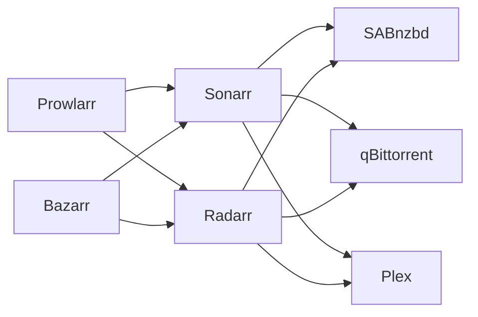

# Service Catalog

## Overview

This catalog provides a comprehensive list of all services running in the infrastructure, organized by category. Each service includes its purpose, access URL, and authentication requirements.

## Quick Access

All services are accessible at `https://service.arsfeld.one` unless otherwise noted.

## Service Categories

### 🎬 Media & Entertainment

| Service | Purpose | URL | Auth | Host |
|---------|---------|-----|------|------|
| **Plex** | Media streaming server | [plex.arsfeld.one](https://plex.arsfeld.one) | ✓ | storage |
| **Jellyfin** | Open-source media server | [jellyfin.arsfeld.one](https://jellyfin.arsfeld.one) | ✓ | storage |
| **Navidrome** | Music streaming server | [music.arsfeld.one](https://music.arsfeld.one) | ✓ | storage |
| **Stash** | Adult content organizer | [stash.arsfeld.one](https://stash.arsfeld.one) | ✓ | storage |
| **Tdarr** | Media transcoding | [tdarr.arsfeld.one](https://tdarr.arsfeld.one) | ✓ | storage |

### 📺 Media Management

| Service | Purpose | URL | Auth | Host |
|---------|---------|-----|------|------|
| **Sonarr** | TV show management | [sonarr.arsfeld.one](https://sonarr.arsfeld.one) | ✓ | storage |
| **Radarr** | Movie management | [radarr.arsfeld.one](https://radarr.arsfeld.one) | ✓ | storage |
| **Lidarr** | Music management | [lidarr.arsfeld.one](https://lidarr.arsfeld.one) | ✓ | storage |
| **Readarr** | Book management | [readarr.arsfeld.one](https://readarr.arsfeld.one) | ✓ | storage |
| **Bazarr** | Subtitle management | [bazarr.arsfeld.one](https://bazarr.arsfeld.one) | ✓ | storage |
| **Prowlarr** | Indexer management | [prowlarr.arsfeld.one](https://prowlarr.arsfeld.one) | ✓ | storage |

### 📥 Download Clients

| Service | Purpose | URL | Auth | Host |
|---------|---------|-----|------|------|
| **SABnzbd** | Usenet downloader | [sabnzbd.arsfeld.one](https://sabnzbd.arsfeld.one) | ✓ | storage |
| **qBittorrent** | BitTorrent client | [qbittorrent.arsfeld.one](https://qbittorrent.arsfeld.one) | ✓ | storage |
| **Transmission** | Lightweight BitTorrent | [transmission.arsfeld.one](https://transmission.arsfeld.one) | ✗ | storage |

### 🔐 Authentication & Security

| Service | Purpose | URL | Auth | Host |
|---------|---------|-----|------|------|
| **Authelia** | Authentication portal | [auth.arsfeld.one](https://auth.arsfeld.one) | ✗ | cloud |
| **LLDAP** | User directory | [users.arsfeld.one](https://users.arsfeld.one) | ✓ | cloud |
| **Dex** | OIDC provider | [rosenfeld.one](https://rosenfeld.one) | ✗ | cloud |
| **Vault** | Secret management | [vault.arsfeld.one](https://vault.arsfeld.one) | ✗ | cloud |

### 📊 Monitoring & Infrastructure

| Service | Purpose | URL | Auth | Host |
|---------|---------|-----|------|------|
| **Grafana** | Metrics dashboards | [grafana.arsfeld.one](https://grafana.arsfeld.one) | ✗ | storage |
| **Netdata** | Real-time monitoring | [netdata.arsfeld.one](https://netdata.arsfeld.one) | ✓ | storage |
| **Homepage** | Service dashboard | [home.arsfeld.one](https://home.arsfeld.one) | ✓ | storage |
| **Beszel** | Service monitoring | [beszel.arsfeld.one](https://beszel.arsfeld.one) | ✓ | storage |
| **Scrutiny** | Disk health monitoring | [scrutiny.arsfeld.one](https://scrutiny.arsfeld.one) | ✓ | storage |
| **Harmonia** | Nix binary cache | [harmonia.arsfeld.one](https://harmonia.arsfeld.one) | ✓ | raider |

### 💾 Storage & Files

| Service | Purpose | URL | Auth | Host |
|---------|---------|-----|------|------|
| **Nextcloud** | File sync & share | [nextcloud.arsfeld.one](https://nextcloud.arsfeld.one) | ✓ | storage |
| **Seafile** | File sync platform | [seafile.arsfeld.one](https://seafile.arsfeld.one) | ✓ | storage |
| **Syncthing** | P2P file sync | [syncthing.arsfeld.one](https://syncthing.arsfeld.one) | ✓ | storage |
| **FileBrowser** | Web file manager | [filebrowser.arsfeld.one](https://filebrowser.arsfeld.one) | ✓ | storage |
| **PairDrop** | Local file sharing | [pairdrop.arsfeld.one](https://pairdrop.arsfeld.one) | ✓ | storage |

### 🛠️ Development Tools

| Service | Purpose | URL | Auth | Host |
|---------|---------|-----|------|------|
| **Gitea** | Git hosting | [git.arsfeld.one](https://git.arsfeld.one) | ✓ | storage |
| **Code-server** | VS Code in browser | [code.arsfeld.one](https://code.arsfeld.one) | ✓ | storage |
| **n8n** | Workflow automation | [n8n.arsfeld.one](https://n8n.arsfeld.one) | ✓ | storage |
| **Act Runner** | GitHub Actions runner | Internal | - | storage |
| **Kestra** | Data orchestration | [kestra.arsfeld.one](https://kestra.arsfeld.one) | ✓ | storage |

### 💬 Communication

| Service | Purpose | URL | Auth | Host |
|---------|---------|-----|------|------|
| **Mattermost** | Team chat | [chat.arsfeld.one](https://chat.arsfeld.one) | ✓ | cloud |
| **Ntfy** | Push notifications | [ntfy.arsfeld.one](https://ntfy.arsfeld.one) | ✗ | cloud |
| **Yarr** | RSS reader | [yarr.arsfeld.one](https://yarr.arsfeld.one) | ✓ | cloud |

### 🌐 Network Services

| Service | Purpose | URL | Auth | Host |
|---------|---------|-----|------|------|
| **Blocky** | Ad-blocking DNS | Internal | - | router |
| **miniUPnPd** | UPnP/NAT-PMP | Internal | - | router |
| **OpenVPN** | VPN server | Internal | - | router |

### 🎮 Gaming & Entertainment

| Service | Purpose | URL | Auth | Host |
|---------|---------|-----|------|------|
| **Minecraft** | Game server | Internal | - | storage |
| **Palworld** | Game server | Internal | - | storage |

### 🤖 AI & Machine Learning

| Service | Purpose | URL | Auth | Host |
|---------|---------|-----|------|------|
| **Ollama** | Local LLM | [ollama.arsfeld.one](https://ollama.arsfeld.one) | ✓ | storage |
| **Open WebUI** | LLM interface | [chat-ui.arsfeld.one](https://chat-ui.arsfeld.one) | ✓ | storage |

### 🔧 Utilities

| Service | Purpose | URL | Auth | Host |
|---------|---------|-----|------|------|
| **2FAuth** | 2FA management | [2fauth.arsfeld.one](https://2fauth.arsfeld.one) | ✓ | cloud |
| **Firefly III** | Personal finance | [finance.arsfeld.one](https://finance.arsfeld.one) | ✓ | cloud |
| **SearXNG** | Meta search engine | [search.arsfeld.one](https://search.arsfeld.one) | ✗ | cloud |
| **Excalidraw** | Collaborative drawing | [draw.arsfeld.one](https://draw.arsfeld.one) | ✓ | cloud |
| **Firefox Sync** | Browser sync | [firefox-syncserver.arsfeld.one](https://firefox-syncserver.arsfeld.one) | ✓ | cloud |

## Service Access Patterns

### Public Services
Services marked with `public: true` are accessible from the internet through Cloudflare.

### Internal Services
Services only accessible within the Tailscale network.

### API Access
Many services provide API endpoints that bypass authentication for automation:
- `*/api/*` - General API access
- `*/rpc` - RPC endpoints
- `*/download/*` - Download endpoints

### Tailscale Funnel
Some services are exposed via Tailscale Funnel for easier sharing.

## Service Integration

### Media Stack Integration

### Authentication Flow
All services (except those marked ✗) require authentication through Authelia, which validates against LLDAP.

## Service Health

### Monitoring
- **Netdata**: Real-time metrics for all services
- **Beszel**: Service uptime and availability
- **Homepage**: Quick status overview

### Backups
All service data is backed up weekly to multiple destinations.

## Adding New Services

To add a new service:
1. Define in `constellation.services`
2. Configure container in host config
3. Add necessary secrets
4. Update this catalog

## Service URLs

### Production Domain
All services use the `arsfeld.one` domain with SSL certificates from Let's Encrypt.

### Internal Access
Services can be accessed directly via Tailscale:
- `http://storage.bat-boa.ts.net:port`
- `http://cloud.bat-boa.ts.net:port`
