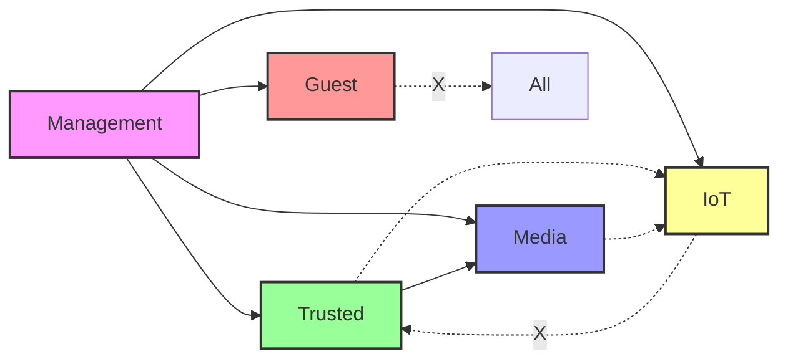

# VLAN Implementation Guide for NixOS Router

## Table of Contents
1. [Overview](#overview)
2. [Current Network Architecture](#current-network-architecture)
3. [VLAN Advantages & Disadvantages](#vlan-advantages--disadvantages)
4. [Implementation Strategy](#implementation-strategy)
5. [Dynamic VLAN Assignment](#dynamic-vlan-assignment)
6. [NixOS Configuration Examples](#nixos-configuration-examples)
7. [Security Considerations](#security-considerations)
8. [Performance Impact](#performance-impact)
9. [Migration Path](#migration-path)

## Overview

VLANs (Virtual Local Area Networks) provide network segmentation at Layer 2, allowing you to create multiple isolated broadcast domains on the same physical infrastructure. This guide explores implementing VLANs on your NixOS router to enhance network security and management.

## Current Network Architecture

Your router currently uses a flat network topology with all LAN ports bridged together:

```
WAN (enp2s0) ──► Router ──► Bridge (br-lan) ──► LAN1 (enp3s0)
                                            ├──► LAN2 (enp4s0)
                                            └──► LAN3 (enp5s0)
```

All devices on the LAN share:
- Single broadcast domain (10.1.1.0/24)
- Same security policies
- Unrestricted inter-device communication

## VLAN Advantages & Disadvantages

### ✅ Advantages

#### 1. **Enhanced Security**
- **Network Isolation**: Prevent IoT devices from accessing critical infrastructure
- **Reduced Attack Surface**: Compromised devices can't reach other VLANs
- **Granular Access Control**: Different firewall rules per VLAN
- **Guest Isolation**: Complete separation for untrusted devices

#### 2. **Better Network Management**
- **Traffic Segmentation**: Reduce broadcast traffic per segment
- **QoS Per VLAN**: Prioritize critical services over IoT traffic
- **Simplified Troubleshooting**: Issues isolated to specific VLANs
- **Logical Organization**: Group devices by function/security level

#### 3. **Scalability**
- **Future-Proof**: Easy to add new network segments
- **Multi-Tenancy**: Support multiple isolated networks
- **Service Separation**: Dedicate VLANs for specific services

#### 4. **Compliance & Best Practices**
- **Zero Trust Architecture**: Implement network microsegmentation
- **Regulatory Compliance**: Meet security requirements for data isolation
- **Professional Standards**: Follow enterprise network design patterns

### ❌ Disadvantages

#### 1. **Increased Complexity**
- **Configuration Overhead**: More complex NixOS configuration
- **Learning Curve**: Requires understanding of VLAN tagging, trunking
- **Troubleshooting Difficulty**: Network issues harder to diagnose
- **Documentation Burden**: Must maintain detailed network documentation

#### 2. **Management Overhead**
- **Device Assignment**: Must manually configure or automate VLAN placement
- **Cross-VLAN Services**: Complex rules for shared services (printers, NAS)
- **Multiple DHCP Scopes**: Separate IP ranges per VLAN
- **DNS Complexity**: May need split-horizon DNS or mDNS reflectors

#### 3. **Hardware Requirements**
- **Switch Support**: Unmanaged switches won't work with VLANs
- **Client Support**: Some IoT devices don't support VLAN tagging
- **Performance**: Router must handle inter-VLAN routing
- **Cost**: May need managed switches (~$50-200 per switch)

#### 4. **User Experience Impact**
- **Device Discovery Issues**: Devices on different VLANs can't auto-discover
- **Casting/Streaming**: Chromecast, AirPlay need special configuration
- **File Sharing**: SMB/NFS access requires firewall rules
- **Initial Setup**: More complex for new devices

## Implementation Strategy

### Proposed VLAN Structure

```yaml
VLANs:
  VLAN 1 (Default/Management):
    ID: 1
    Network: 10.1.1.0/24
    Purpose: Infrastructure, servers, management
    
  VLAN 10 (Trusted):
    ID: 10
    Network: 10.1.10.0/24
    Purpose: Workstations, laptops, phones
    
  VLAN 20 (IoT):
    ID: 20
    Network: 10.1.20.0/24
    Purpose: Smart home devices, cameras, sensors
    
  VLAN 30 (Guest):
    ID: 30
    Network: 10.1.30.0/24
    Purpose: Visitor devices, temporary access
    
  VLAN 40 (Media):
    ID: 40
    Network: 10.1.40.0/24
    Purpose: TVs, streaming devices, game consoles
```

### Inter-VLAN Communication Rules



Legend:
- Solid arrow: Full access
- Dotted arrow: Limited access (specific ports)
- X arrow: No access

## Dynamic VLAN Assignment

### Yes, Dynamic Assignment is Possible!

You can dynamically assign clients to VLANs using several methods:

### Method 1: **MAC-Based VLAN Assignment (802.1X)**

Most suitable for your setup. Devices are assigned to VLANs based on MAC address:

```nix
# Example configuration
services.hostapd = {
  enable = true;
  radios.wlan0 = {
    settings = {
      ssid = "HomeNetwork";
      wpa = 2;
      wpa_key_mgmt = "WPA-PSK";
      # Enable dynamic VLAN
      dynamic_vlan = 1;
      vlan_file = "/etc/hostapd/vlan.conf";
    };
  };
};

# MAC to VLAN mapping
environment.etc."hostapd/vlan.conf".text = ''
  # IoT Devices
  aa:bb:cc:dd:ee:01 20  # Smart TV
  aa:bb:cc:dd:ee:02 20  # Thermostat
  aa:bb:cc:dd:ee:03 20  # Security Camera
  
  # Trusted Devices
  aa:bb:cc:dd:ee:10 10  # Laptop
  aa:bb:cc:dd:ee:11 10  # Phone
  
  # Media Devices
  aa:bb:cc:dd:ee:20 40  # Xbox
  aa:bb:cc:dd:ee:21 40  # AppleTV
'';
```

### Method 2: **RADIUS-Based Assignment**

Enterprise solution using FreeRADIUS:

```nix
services.freeradius = {
  enable = true;
  configDir = ./radius-config;
};

# RADIUS returns VLAN attributes based on:
# - Username/password (802.1X)
# - MAC address
# - Device certificate
# - Time of day
# - Device fingerprinting
```

### Method 3: **Device Fingerprinting with PacketFence**

Advanced solution that identifies devices by behavior:

```nix
# Theoretical NixOS module (would need packaging)
services.packetfence = {
  enable = true;
  autoRegister = true;
  fingerprinting = {
    enable = true;
    rules = [
      { match = "iPhone"; vlan = 10; }
      { match = "Amazon-Echo"; vlan = 20; }
      { match = "Roku"; vlan = 40; }
      { match = "Ring-Doorbell"; vlan = 20; }
    ];
  };
};
```

### Method 4: **DHCP Option-Based Assignment**

Using Kea DHCP with client classification:

```nix
services.kea.dhcp4 = {
  settings = {
    client-classes = [
      {
        name = "iot-devices";
        test = "substring(option[vendor-class-identifier],0,6) == 'amazon'";
        next-server = "10.1.20.1";
        option-data = [{
          name = "routers";
          data = "10.1.20.1";
        }];
      }
      {
        name = "trusted-devices";
        test = "substring(option[hostname],0,7) == 'laptop-'";
        next-server = "10.1.10.1";
      }
    ];
  };
};
```

### Method 5: **Captive Portal with Self-Selection**

Let users choose their network type:

```nix
services.captive-portal = {
  enable = true;
  defaultVlan = 30; # Start in guest
  portal = {
    authMethods = [ "password" "voucher" ];
    vlanSelection = {
      "Home Devices" = 10;
      "IoT Devices" = 20;
      "Guest Access" = 30;
    };
  };
};
```

## NixOS Configuration Examples

### Basic VLAN Setup

```nix
# /hosts/router/vlans.nix
{ config, lib, pkgs, ... }:

{
  # Enable VLAN support
  boot.kernelModules = [ "8021q" ];
  
  # Create VLAN interfaces
  networking.vlans = {
    "vlan10" = {
      id = 10;
      interface = "br-lan";
    };
    "vlan20" = {
      id = 20;
      interface = "br-lan";
    };
    "vlan30" = {
      id = 30;
      interface = "br-lan";
    };
    "vlan40" = {
      id = 40;
      interface = "br-lan";
    };
  };
  
  # Assign IP addresses to VLAN interfaces
  networking.interfaces = {
    "vlan10" = {
      ipv4.addresses = [{
        address = "10.1.10.1";
        prefixLength = 24;
      }];
    };
    "vlan20" = {
      ipv4.addresses = [{
        address = "10.1.20.1";
        prefixLength = 24;
      }];
    };
    "vlan30" = {
      ipv4.addresses = [{
        address = "10.1.30.1";
        prefixLength = 24;
      }];
    };
    "vlan40" = {
      ipv4.addresses = [{
        address = "10.1.40.1";
        prefixLength = 24;
      }];
    };
  };
}
```

### DHCP Configuration per VLAN

```nix
services.kea.dhcp4 = {
  enable = true;
  settings = {
    interfaces-config = {
      interfaces = [ "vlan10" "vlan20" "vlan30" "vlan40" ];
    };
    
    subnet4 = [
      {
        subnet = "10.1.10.0/24";
        interface = "vlan10";
        pools = [{ pool = "10.1.10.10 - 10.1.10.254"; }];
        option-data = [
          { name = "routers"; data = "10.1.10.1"; }
          { name = "domain-name-servers"; data = "10.1.10.1"; }
        ];
      }
      {
        subnet = "10.1.20.0/24";
        interface = "vlan20";
        pools = [{ pool = "10.1.20.10 - 10.1.20.254"; }];
        option-data = [
          { name = "routers"; data = "10.1.20.1"; }
          { name = "domain-name-servers"; data = "10.1.20.1"; }
        ];
        # IoT devices get shorter leases
        valid-lifetime = 3600;
      }
      {
        subnet = "10.1.30.0/24";
        interface = "vlan30";
        pools = [{ pool = "10.1.30.10 - 10.1.30.254"; }];
        option-data = [
          { name = "routers"; data = "10.1.30.1"; }
          # Guest devices use public DNS
          { name = "domain-name-servers"; data = "1.1.1.1, 8.8.8.8"; }
        ];
        # Guest devices get very short leases
        valid-lifetime = 1800;
      }
    ];
  };
};
```

### Firewall Rules for VLANs

```nix
networking.nftables.ruleset = ''
  table inet filter {
    # Define network groups
    define trusted_net = 10.1.10.0/24
    define iot_net = 10.1.20.0/24
    define guest_net = 10.1.30.0/24
    define media_net = 10.1.40.0/24
    
    chain forward {
      type filter hook forward priority 0; policy drop;
      
      # Established connections
      ct state established,related accept
      
      # Management can access everything
      iifname "br-lan" accept
      
      # Trusted can access Media and limited IoT
      iifname "vlan10" oifname "vlan40" accept
      iifname "vlan10" oifname "vlan20" tcp dport { 80, 443, 8123 } accept
      
      # Media can access limited IoT (for smart TV controls)
      iifname "vlan40" oifname "vlan20" tcp dport { 8080, 8443 } accept
      
      # IoT cannot initiate connections to Trusted
      iifname "vlan20" oifname "vlan10" drop
      
      # Guest isolated from everything except WAN
      iifname "vlan30" oifname "${interfaces.wan}" accept
      iifname "vlan30" drop
      
      # All VLANs can access WAN
      oifname "${interfaces.wan}" accept
    }
  }
'';
```

### mDNS Reflector for Cross-VLAN Discovery

```nix
services.avahi = {
  enable = true;
  reflector = true;
  interfaces = [ "vlan10" "vlan40" ];  # Reflect between Trusted and Media
  allowInterfaces = [ "vlan10" "vlan40" ];
  
  # Don't reflect to IoT or Guest
  denyInterfaces = [ "vlan20" "vlan30" ];
};
```

## Security Considerations

### VLAN Hopping Prevention

```nix
# Disable DTP (Cisco Discovery Protocol)
boot.kernel.sysctl = {
  "net.bridge.bridge-nf-filter-vlan-tagged" = 1;
};

# Force access mode on edge ports
systemd.network.networks = {
  "50-vlan-security" = {
    matchConfig.Name = "enp*";
    # Drop native VLAN tags
    bridgeVLANs = [
      { VLAN = 1; PVID = true; EgressUntagged = true; }
    ];
  };
};
```

### Private VLAN Implementation

```nix
# Isolate devices within the same VLAN
networking.bridges."br-isolated" = {
  interfaces = [];
  rstp = true;
  # Enable port isolation
  extraConfig = ''
    bridge-port-isolation on
  '';
};
```

## Performance Impact

### Expected Performance Metrics

| Metric | Without VLANs | With VLANs | Impact |
|--------|--------------|------------|---------|
| **Latency** | <1ms | 1-2ms | +1ms for inter-VLAN |
| **Throughput** | 1 Gbps | 950 Mbps | ~5% overhead |
| **CPU Usage** | 5-10% | 10-20% | +5-10% for routing |
| **Memory** | 500 MB | 600 MB | +100 MB for tables |

### Optimization Tips

1. **Hardware Offloading**
```nix
boot.kernelParams = [ 
  "intel_iommu=on" 
  "iommu=pt" 
];
networking.interfaces.*.offload = {
  tso = true;
  gso = true;
  gro = true;
};
```

2. **Jumbo Frames for Inter-VLAN**
```nix
networking.interfaces = {
  "vlan10".mtu = 9000;
  "vlan20".mtu = 9000;
};
```

3. **Connection Tracking Optimization**
```nix
boot.kernel.sysctl = {
  "net.netfilter.nf_conntrack_max" = 1048576;
  "net.netfilter.nf_conntrack_tcp_timeout_established" = 3600;
};
```

## Migration Path

### Phase 1: Preparation (Week 1)
1. Document all devices and their MAC addresses
2. Categorize devices by type and security requirements
3. Plan IP address allocation per VLAN
4. Order managed switch if needed

### Phase 2: Testing (Week 2)
1. Set up VLANs in parallel with existing network
2. Test with non-critical devices
3. Verify inter-VLAN routing works
4. Test all services (DNS, DHCP, etc.)

### Phase 3: Gradual Migration (Week 3-4)
1. Move IoT devices first (least critical)
2. Move media devices
3. Move trusted devices
4. Set up guest network

### Phase 4: Optimization (Week 5)
1. Fine-tune firewall rules
2. Implement QoS policies
3. Set up monitoring per VLAN
4. Document final configuration

## Monitoring & Troubleshooting

### Per-VLAN Metrics

```nix
services.prometheus.scrapeConfigs = [
  {
    job_name = "vlan-metrics";
    static_configs = [{
      targets = [ "localhost:9101" ];
      labels = {
        vlan = "10";
        name = "trusted";
      };
    }];
  }
];

# Custom exporter for VLAN statistics
systemd.services.vlan-exporter = {
  script = ''
    #!/usr/bin/env bash
    while true; do
      for vlan in vlan10 vlan20 vlan30 vlan40; do
        echo "vlan_traffic_bytes{vlan=\"$vlan\",direction=\"rx\"} $(cat /sys/class/net/$vlan/statistics/rx_bytes)"
        echo "vlan_traffic_bytes{vlan=\"$vlan\",direction=\"tx\"} $(cat /sys/class/net/$vlan/statistics/tx_bytes)"
      done > /var/lib/prometheus/node-exporter/vlan.prom
      sleep 10
    done
  '';
};
```

### Troubleshooting Commands

```bash
# Show VLAN configuration
ip -d link show | grep vlan

# Check VLAN tagging
tcpdump -i br-lan -e -n vlan

# Test inter-VLAN routing
ping -I vlan10 10.1.20.1

# Show bridge VLAN table
bridge vlan show

# Monitor VLAN traffic
iftop -i vlan20

# Check DHCP leases per VLAN
keactrl lease-get all | jq '.[] | select(.subnet_id == 20)'
```

## Conclusion

VLANs offer significant security and management benefits but come with increased complexity. For your home network with various IoT devices, the security advantages likely outweigh the disadvantages, especially if you:

1. Have IoT devices you don't fully trust
2. Want to provide guest access
3. Need to comply with security best practices
4. Plan to expand your network

Start with a simple 3-VLAN setup (Trusted, IoT, Guest) and expand as needed. Use MAC-based assignment initially, then consider more sophisticated methods as your network grows.

## Quick Decision Matrix

| If you have... | Recommendation |
|---------------|----------------|
| < 10 devices, all trusted | **Skip VLANs** - Not worth complexity |
| 10-30 devices, some IoT | **Basic VLANs** - 3 VLANs (Trusted/IoT/Guest) |
| 30+ devices, security concerns | **Full VLANs** - 5+ VLANs with dynamic assignment |
| Compliance requirements | **Required** - Implement full segmentation |
| Limited time/expertise | **Wait** - Use firewall rules instead |

## Next Steps

1. **Evaluate**: Count your devices and categorize them
2. **Plan**: Design your VLAN structure
3. **Test**: Set up a test VLAN first
4. **Implement**: Migrate gradually
5. **Monitor**: Use Grafana dashboards for per-VLAN metrics
6. **Document**: Keep detailed network documentation
7. **Automate**: Implement dynamic assignment once stable